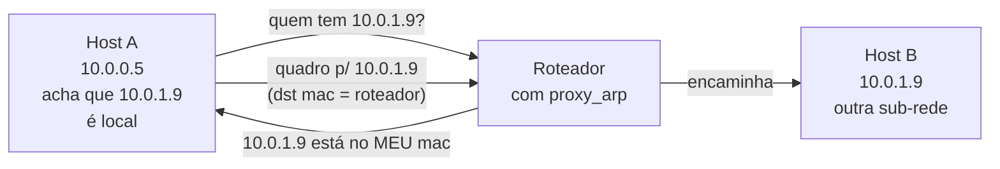

# 15 · Variações do protocolo — gratuitous, proxy, RARP, InARP, multicast

> **Nível:** intermediário → avançado
> **Data:** 14/08/2026
> O ARP básico é pergunta-resposta. Em volta dele cresceu uma família. Cada membro resolve um
> problema real — e alguns criam problemas novos.

---

## 1. O ARP "normal" em uma frase

Request (broadcast) "quem tem o IP X?" → reply (unicast) "sou eu, MAC Y". Coberto nos
capítulos [12](12-anatomia-do-pacote.md) e [13](13-o-ciclo-de-resolucao.md). As variações abaixo
reusam o **mesmo formato de pacote**, mudando quem preenche o quê.

---

## 2. Gratuitous ARP (ARP gratuito / não solicitado)

**O que é:** um ARP em que **SPA == TPA** — você fala do seu próprio IP. Ninguém perguntou.

Dois sabores:

- **request gratuito:** "quem tem *o meu* IP?" (com SPA = seu IP, ou SPA = 0.0.0.0 no *probe*).
  Usado para **detectar conflito**: se alguém responder, seu IP está duplicado.
- **reply gratuito:** "*o meu* IP está no MAC Y", enviado em broadcast sem pergunta prévia.
  Usado para **atualizar os caches de todo mundo** de uma vez.

**Para que serve, na prática:**

| Uso | Por quê |
|---|---|
| **Detecção de IP duplicado** (RFC 5227) | ao subir uma interface, o host pergunta pelo próprio IP; resposta = conflito. É o `arping -D`. |
| **Failover de IP virtual** (VRRP, keepalived, IP flutuante de nuvem) | quando o IP `.100` migra do servidor A para o B, o B dispara gratuitous ARP e **todo o segmento atualiza o MAC na hora** — o tráfego "vira" em milissegundos em vez de esperar minutos de envelhecimento. |
| **Bond/failover de placa** | ao trocar a placa ativa, anuncia o novo MAC para o mesmo IP. |
| **Migração de VM ao vivo** | o hipervisor emite gratuitous ARP no destino para redirecionar o tráfego à nova máquina física. |

Comando: `sudo arping -U -c 3 -I enp2s0 10.209.0.100` ([06](06-exemplos.md) exemplo 12).

**O lado sombrio:** gratuitous ARP é exatamente o mecanismo do **envenenamento de cache**. Um
atacante manda "o gateway está no *meu* MAC" e todos redirecionam para ele. Mesmo pacote,
intenção oposta. Ver [18](18-seguranca.md). Por isso `arp_accept` controla se o host cria
entrada a partir de gratuitous ARP de IP desconhecido.

---

## 3. Proxy ARP

**O que é:** um roteador responde a requests ARP por IPs que **não são dele**, dando o **próprio
MAC**, para que hosts entreguem a ele pacotes destinados a outra sub-rede — como se tudo fosse um
único segmento.



**Para que serviu:** juntar duas sub-redes fisicamente separadas sem reconfigurar máscaras nos
hosts (útil nos anos 1990); dar conectividade a hosts com máscara "errada"; conectar links
seriais e VPNs; dial-up.

**Por que quase morreu:** esconde a topologia real, quebra o modelo mental de "próximo salto",
dificulta diagnóstico e infla caches ARP (um MAC servindo dezenas de IPs — o
[07-projeto-modelo](07-projeto-modelo/) sinaliza isso como anomalia). É "cola" que mascara um
projeto de rede ruim.

**Onde ainda vive, legitimamente:** VPNs e software de nuvem que precisam pôr um cliente "dentro"
de uma sub-rede remota; algumas configurações de container/hypervisor. Habilita-se com
`sysctl net.ipv4.conf.<if>.proxy_arp=1`.

> **Opinião do autor:** proxy ARP em rede corporativa quase sempre é sintoma de que a
> segmentação foi feita errada e alguém "resolveu" com um atalho. Use roteamento de verdade.

---

## 4. RARP — o ARP invertido (morto)

**O que era:** *Reverse ARP* (RFC 903, 1984), EtherType `0x8035`. A pergunta invertida: "eu sei
o **meu MAC**, qual é o **meu IP**?". Uma estação sem disco, ao ligar, não sabia seu próprio IP;
gritava o MAC e um servidor RARP respondia o IP.

**Por que morreu:** só entregava o IP, nada mais (sem máscara, sem gateway, sem DNS), e o
servidor tinha de estar no mesmo segmento. **BOOTP** (1985) e depois **DHCP** (1993) fizeram
tudo isso e mais — por UDP, roteável, com opções ricas. RARP não tem uso em rede nova desde os
anos 1990. Aparece só em provas e em sistemas legados muito antigos.

---

## 5. Como o multicast dispensa o ARP

Você viu no [14](14-a-tabela-por-dentro.md) §6 entradas `NOARP` para `224.0.0.x`. Endereços
multicast IPv4 **não** usam ARP: o MAC é **calculado** do IP por uma regra fixa
(RFC 1112). Os 23 bits baixos do IP multicast vão para os 23 bits baixos do prefixo MAC
`01:00:5e`:

```
IP  224.0.0.251  → MAC  01:00:5e:00:00:fb
IP  239.1.2.3    → MAC  01:00:5e:01:02:03
```

Sem pergunta, sem resposta — puro cálculo. Idem broadcast (`255.255.255.255` →
`ff:ff:ff:ff:ff:ff`). Por isso essas entradas são `NOARP`: não há o que resolver. (Há uma
ambiguidade conhecida — 32 IPs multicast mapeiam para o mesmo MAC, porque só 23 dos 28 bits
cabem — mas isso é problema de multicast, não de ARP.)

---

## 6. InARP — o primo de WAN (raríssimo)

*Inverse ARP* (RFC 2390), opcodes 8/9. Em redes Frame Relay e ATM, um roteador conhece o
**circuito virtual** (o "MAC" daquela tecnologia) mas não o IP do outro lado; InARP pergunta
"qual IP está neste circuito?". Praticamente extinto com o fim do Frame Relay. Citado por
completude — você pode encontrá-lo em documentação Cisco antiga.

---

## 7. Tabela-resumo da família

| Variante | Pergunta | Opcode/EtherType | Vivo em 2026? |
|---|---|---|---|
| ARP request/reply | IP → MAC | 1 / 2, `0x0806` | **sim**, onipresente |
| Gratuitous ARP | anuncia o próprio IP↔MAC | 1 ou 2, SPA==TPA | **sim** (failover, DAD) |
| ARP Probe (RFC 5227) | "isto é de alguém?" | 1, SPA=0.0.0.0 | **sim** (config de IP) |
| Proxy ARP | roteador responde por outros | 2, `0x0806` | **nichado** (VPN, nuvem) |
| RARP | MAC → IP (o próprio) | 3 / 4, `0x8035` | **morto** (→ DHCP) |
| InARP | circuito → IP | 8 / 9 | **morto** (→ fim do Frame Relay) |
| Multicast (não é ARP) | IP mcast → MAC calculado | — (`NOARP`) | **sim** (cálculo, sem protocolo) |

---

## Autoteste

1. O que caracteriza um pacote como *gratuitous ARP*, olhando os campos?
2. Cite dois usos legítimos e um uso malicioso do gratuitous ARP — todos com o mesmo pacote.
3. O que o proxy ARP faz, e por que é malvisto em rede corporativa moderna?
4. Por que o RARP morreu, se resolvia um problema real?
5. Como o MAC de `239.1.2.3` é obtido, e por que essa entrada aparece como `NOARP`?
6. Um MAC aparece respondendo por 40 IPs diferentes. Cite duas explicações plausíveis.
7. Um IP virtual migrou de servidor e o tráfego levou 2 minutos para "virar". Que mecanismo
   deveria ter sido usado para virar em milissegundos?

---

**Fontes:** RFC 826, 903, 1027 (proxy), 1112 (multicast→MAC), 2390 (InARP), 5227 (ACD/probe);
`sysctl` de `proxy_arp`/`arp_accept` locais. Consultado em 14/08/2026.

**Próximo:** [16-arp-em-cada-sistema.md](16-arp-em-cada-sistema.md)
