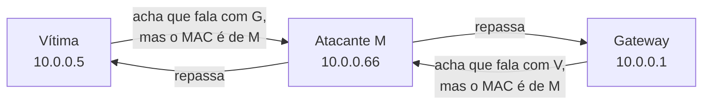

# 18 · Segurança — ARP spoofing, e por que ele ainda funciona em 2026

> **Nível:** avançado
> **Data:** 14/08/2026
>
> ⚠️ **Aviso legal, leia antes.** As técnicas ofensivas aqui são explicadas para **defesa e
> laboratório**. Executá-las em rede que você não controla, sem autorização escrita, é crime no
> Brasil (**art. 154-A do Código Penal**, invasão de dispositivo informático; e possivelmente a
> LGPD, por interceptar dados). Faça ataques **apenas** no laboratório isolado do
> [03](03-instalacao.md) §9. Veja também o assunto [ethical-hacking](../ethical-hacking/00-MAPA.md).

---

## 1. A falha de nascença

O ARP (1982) **não autentica nada**. Qualquer máquina no segmento pode afirmar "o IP X está no
meu MAC" e os outros acreditam. Não há assinatura, nem desafio, nem verificação. Isso foi uma
decisão razoável para um cabo num laboratório ([11](11-historia.md) §2) e é a raiz de toda a
insegurança de camada 2 que sobrevive até hoje.

Três propriedades do protocolo se combinam para o desastre:
1. **caches aceitam atualizações não solicitadas** (gratuitous ARP, aprendizado passivo);
2. **quem responde por último, ou mais rápido, vence** (última resposta sobrescreve);
3. **não há como distinguir uma resposta legítima de uma forjada** — os bytes são idênticos.

---

## 2. ARP spoofing / poisoning — a mecânica

O atacante (M), na mesma LAN que a vítima (V) e o gateway (G), envia:

- para **V**: "o gateway `G` está no *meu* MAC" (gratuitous ARP/reply forjado);
- para **G**: "a vítima `V` está no *meu* MAC".

Resultado: V manda para M o que era para G, e G manda para M o que era para V. **M está no meio**
(*man-in-the-middle*), repassando o tráfego (para não derrubar a conexão) e podendo **ler,
registrar ou alterar** tudo que não estiver cifrado fim-a-fim.



O que isso habilita: sniffing de tráfego não cifrado, *SSL stripping* (rebaixar HTTPS→HTTP se a
vítima não usa HSTS), sequestro de sessão, DNS spoofing combinado, e negação de serviço (mandar
para um MAC inexistente derruba a conexão).

Ferramentas prontas (para lab): `ettercap`, `bettercap`, `dsniff` (`arpspoof`), ou ~15 linhas de
Scapy. **Não** reproduzo o payload de ataque aqui; o objetivo é você reconhecer e defender.

Por que ainda funciona em 2026: a maioria das redes internas (escritórios, escolas, cafés) **não**
liga as defesas do §4. E a defesa real (DAI) exige switches gerenciados bem configurados, que
muita rede não tem.

---

## 3. Como detectar

**Sinais na tabela ARP:**

- o **MAC do gateway muda** de repente, ou dois IPs (gateway e outro) passam a ter o **mesmo
  MAC** → clássico. O [07-projeto-modelo](07-projeto-modelo/) sinaliza exatamente isto
  ("IP com MACs diferentes" e "MAC servindo vários IPs");
- entradas oscilando entre dois MACs (`ip monitor neigh` mostra ao vivo).

**Ferramenta de monitoramento — `arpwatch`:**
```bash
sudo apt install -y arpwatch
sudo arpwatch -i enp2s0             # registra pares IP↔MAC; loga em syslog quando um muda
journalctl -u arpwatch -f           # acompanhe; procure "changed ethernet address" / "flip flop"
```
`arpwatch` aprende a linha de base e **alerta** em toda mudança de par IP↔MAC — a assinatura de
spoofing (e também de trocas legítimas de hardware, que você aprende a distinguir).

**Verificação pontual:**
```bash
# o MAC do gateway agora bate com o que você anotou quando a rede estava sã?
ip neigh show $(ip route | grep -oP 'default via \K\S+')
```

---

## 4. Como defender (em ordem de eficácia)

| Defesa | Onde | Eficácia | Custo |
|---|---|---|---|
| **Dynamic ARP Inspection (DAI) + DHCP Snooping** | switch gerenciado | **alta** — a defesa de verdade | exige switch bom e config |
| **Cifra fim-a-fim** (HTTPS/HSTS, SSH, VPN, TLS) | aplicação | **alta** contra o *objetivo* do ataque | já deve existir |
| **Entrada ARP estática** do gateway | host | média (protege 1 host, 1 sentido) | manutenção manual |
| **Port security** (limita MACs por porta) | switch | média | config |
| **`arpwatch`/monitoramento** | rede | detecta, não previne | baixo |
| **Segmentação** (VLANs menores, private VLAN) | rede | reduz superfície | projeto |
| **802.1X** (autenticação de porta) | rede | alta (impede o atacante de entrar) | infraestrutura |

**Dynamic ARP Inspection** é a defesa canônica. Ideia: o switch já sabe, via **DHCP Snooping**,
quais pares IP↔MAC↔porta são legítimos (ele viu o DHCP acontecer). Todo ARP que **não bate** com
essa base é **descartado na porta**, antes de envenenar ninguém.

Ordem de configuração (Cisco; conceito vale para outros fabricantes) — DHCP Snooping **primeiro**,
sempre:
```
! 1. DHCP snooping global e na VLAN
ip dhcp snooping
ip dhcp snooping vlan 10
! 2. portas de uplink / servidor DHCP são CONFIÁVEIS
interface Gi0/1
 ip dhcp snooping trust
! 3. DAI na VLAN (usa a base do snooping)
ip arp inspection vlan 10
! 4. uplinks também confiáveis para ARP
interface Gi0/1
 ip arp inspection trust
```
Portas de host ficam **não confiáveis** (padrão) e têm ARP validado + *rate limit* (padrão ~15
pps). Em rede sem DHCP, usa-se **ARP ACLs** estáticas no lugar da base de snooping.

> **Recomendação do autor.** Priorize nesta ordem: (1) **cifra fim-a-fim** — torna o ataque
> inútil mesmo se ocorrer, e você deveria ter de qualquer jeito; (2) **DAI + DHCP snooping** —
> mata o ataque na origem, se você tem switch gerenciado; (3) **entrada estática do gateway** nos
> hosts críticos — barato e eficaz para o alvo mais visado. Monitoramento (`arpwatch`) é
> complemento, não substituto: ele avisa **depois** que começou.

---

## 5. Endurecer o host Linux

```bash
# 1. fixar o gateway como PERMANENT (ignora ARP forjado) — ver cap. 06 exemplo 7
GW=$(ip route | grep -oP 'default via \K\S+')
GWMAC=$(ip neigh show $GW | grep -oE '([0-9a-f]{2}:){5}[0-9a-f]{2}')
sudo ip neigh replace $GW lladdr $GWMAC dev enp2s0 nud permanent

# 2. NÃO aprender de gratuitous ARP de IP desconhecido (é o padrão; confirme)
sysctl net.ipv4.conf.enp2s0.arp_accept       # deve ser 0

# 3. responder ARP de forma restritiva (servidores multi-homed)
sudo sysctl -w net.ipv4.conf.all.arp_ignore=1
sudo sysctl -w net.ipv4.conf.all.arp_announce=2

# 4. monitorar mudanças
sudo arpwatch -i enp2s0
```

Limitações honestas: a entrada `PERMANENT` protege **um** host e **um** sentido (V→G); o atacante
ainda pode envenenar G→V no gateway. A defesa completa é no switch (DAI) e/ou cifra. E `PERMANENT`
quebra failover VRRP legítimo (o MAC virtual muda de dono) — documente.

---

## 6. Outros ataques de camada 2 que orbitam o ARP

- **MAC flooding**: inundar a tabela CAM do switch até ele "falhar aberto" e virar um hub,
  inundando tudo por todas as portas (permitindo sniffing). Defesa: *port security*.
- **ARP DoS**: envenenar com um MAC inexistente derruba a vítima. Subcaso do spoofing.
- **DHCP starvation/spoofing**: esgotar o pool ou subir um DHCP falso — casado com ARP spoofing
  para MITM completo. Defesa: DHCP snooping (a mesma base do DAI).

Todos são camada 2, todos exploram a mesma confiança implícita, todos são cercados pelas mesmas
defesas de switch gerenciado. O ARP spoofing é o mais famoso, mas é uma família.

---

## 7. Por que não "consertar o ARP"

Já dito na [11](11-historia.md), mas cabe aqui: **não dá para trocar o protocolo**. Há bilhões de
dispositivos que só falam o ARP de 1982; um "ARP seguro" incompatível dividiria a rede. O NDP do
IPv6 tem um mecanismo seguro (**SEND**, RFC 3971, com criptografia), mas é tão pouco implementado
que quase ninguém usa — e o IPv6 ainda não substituiu o IPv4. Então a segurança de camada 2
continuará, por muitos anos, sendo feita **em volta** do ARP: no switch, na cifra, no
monitoramento. Aceitar isso é parte de operar rede com maturidade.

---

## Autoteste

1. Quais três propriedades do ARP, combinadas, tornam o spoofing possível?
2. Descreva o que o atacante envia para a vítima e para o gateway, e por que precisa repassar o
   tráfego.
3. Qual é a assinatura de spoofing visível na tabela ARP? Como o projeto-modelo a detecta?
4. Por que DHCP Snooping precisa vir **antes** do DAI?
5. Ordene as defesas por eficácia e explique por que cifra fim-a-fim está no topo.
6. Quais as duas limitações da entrada `PERMANENT` do gateway como defesa?
7. Por que não se "atualiza" o ARP para uma versão autenticada, se a falha é conhecida há décadas?

---

**Fontes:** RFC 826, 5227; documentação Cisco DAI/DHCP Snooping (pesquisada em 14/08/2026);
RFC 3971 (SEND); Código Penal art. 154-A; man `arpwatch`, `ettercap`. Ver
[95-referencias](95-referencias.md).

**Próximo:** [19-diagnostico.md](19-diagnostico.md)
