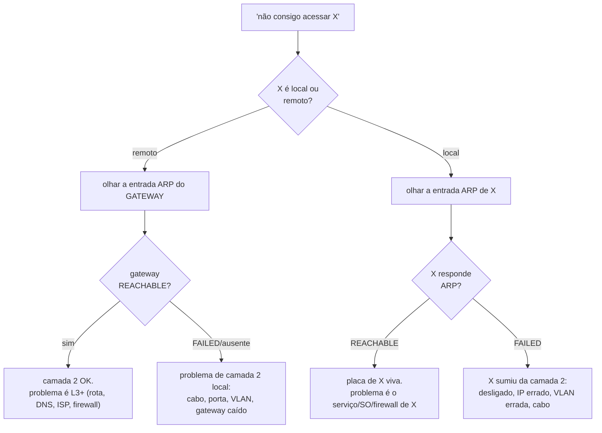

# 19 · Diagnóstico — a tabela ARP como primeira ferramenta

> **Nível:** intermediário → avançado
> **Data:** 14/08/2026
> Um roteiro de campo. A tabela ARP responde, em segundos, "o problema é local ou remoto?" — e
> essa resposta corta o tempo de diagnóstico pela metade.

---

## 1. A árvore de decisão



A pergunta-chave: **X está na minha sub-rede?** Se não, o vizinho que importa é o **gateway** —
não adianta olhar o ARP de um IP remoto, ele nunca estará na sua tabela ([13](13-o-ciclo-de-resolucao.md)).

---

## 2. Os comandos, na ordem

```bash
# 1. quem é meu gateway e minha rede
ip route | grep default
ip -br addr

# 2. a entrada ARP do próximo salto relevante
ip neigh show <gateway-ou-IP-local>

# 3. provocar resolução e reobservar
ping -c1 <ip> ; ip neigh show <ip>

# 4. testar camada 2 sem depender de ICMP (host que ignora ping)
ip neigh get <ip> dev <if>          # ou: sudo arping -c2 -I <if> <ip>

# 5. ver a troca ao vivo, se preciso
ip monitor neigh &
sudo tcpdump -i <if> -e -n arp
```

---

## 3. Sintomas → causa → ação

| Sintoma na tabela | Causa provável | Ação |
|---|---|---|
| gateway `FAILED`/ausente, e nada funciona | camada 2 quebrada: cabo, porta do switch, VLAN errada, gateway caído | checar link (`ip link`), cabo, porta; falar com quem cuida do switch |
| gateway `REACHABLE`, mas Internet não abre | L3+ : rota, DNS, firewall, ISP | `ping 8.8.8.8` (rota) vs `ping google.com` (DNS); testar do gateway p/ fora |
| host local `FAILED`, mas o gateway OK | host desligado, IP errado, VLAN diferente, cabo do host | confirmar IP/VLAN do host; ver se ele está ligado |
| host `REACHABLE` mas serviço não responde | placa viva, mas SO/serviço/firewall do host | subir de camada: `nc -vz <ip> <porta>`, logs do serviço |
| MAC do gateway **mudou** de repente | VRRP failover (legítimo) **ou** ARP spoofing (ataque) | comparar com MAC virtual VRRP `00:00:5e:...`; rodar `arpwatch` ([18](18-seguranca.md)) |
| dois IPs com o **mesmo** MAC | roteador/proxy ARP (ok) **ou** host se passando por vários (ataque) | ver [07-projeto-modelo](07-projeto-modelo/); investigar |
| um IP oscila entre **dois** MACs | **IP duplicado** ou spoofing | `arping -D`; achar o intruso; `arpwatch` |
| conectividade intermitente, `dmesg` com `neighbor table overflow` | tabela de vizinhos cheia (`gc_thresh3`) | aumentar `gc_thresh*` e **resegmentar** ([14](14-a-tabela-por-dentro.md) §7) |
| tráfego lento, switch com CPU alta, quadros por portas erradas | *unicast flooding* por timers ARP/MAC descasados | casar `arp timeout` ≤ MAC aging ([17](17-arp-em-redes-reais.md) §4) |
| tudo `STALE` e funciona | **normal** — `STALE` é usável | não fazer nada |

---

## 4. Os dois erros de interpretação mais comuns

1. **"A entrada está `STALE`, por isso está lento."** — Falso. `STALE` envia o pacote na hora
   ([14](14-a-tabela-por-dentro.md) §2). `STALE` nunca é a causa de lentidão. Procure em outro
   lugar.
2. **"O ARP está `REACHABLE`, então está tudo certo."** — Só a **camada 2** está certa. O
   serviço pode estar morto. ARP bom é condição necessária, não suficiente. É o primeiro degrau.

---

## 5. Caso resolvido, passo a passo *(exemplo de campo)*

**Relato:** "o servidor de arquivos `10.0.5.20` parou para todo mundo."

1. De um cliente: `ip neigh show 10.0.5.20` → **`FAILED`**. Camada 2 não enxerga o servidor.
2. `ping 10.0.5.20` → *Destination Host Unreachable* (vindo do próprio cliente — confirma ARP
   falho, não é o servidor recusando).
3. O gateway está `REACHABLE`? Sim → a rede local do cliente está boa; o problema é no servidor
   ou no caminho até ele.
4. Do mesmo VLAN do servidor, `arping -c2 10.0.5.20` → sem resposta. A placa do servidor não
   responde ARP.
5. Hipóteses: servidor desligado; placa/cabo; ou **mudou de VLAN**. Console do servidor mostra
   que ele está ligado, mas `ip -br addr` revela que ele pegou IP `169.254.x.x` (APIPA) → o
   **DHCP falhou** e ele está sem o IP `10.0.5.20`.
6. Causa raiz: porta do switch reconfigurada para a VLAN errada numa manutenção → sem DHCP →
   sem IP → sem ARP → "sumiu". Correção no switch, não no servidor.

A tabela ARP (`FAILED`) foi o que, em 10 segundos, apontou "camada 2/local" e evitou horas
investigando o serviço de arquivos, que estava intacto.

---

## 6. Kit de diagnóstico rápido (copie e guarde)

```bash
gw=$(ip route | grep -oP 'default via \K\S+')
echo "== eu =="; ip -br addr; ip route | grep default
echo "== gateway =="; ping -c1 -W1 $gw >/dev/null; ip neigh show $gw
echo "== tabela =="; ip -br neigh show | sort
echo "== mortos =="; ip neigh show nud failed
echo "== overflow? =="; dmesg 2>/dev/null | grep -i "neighbor table overflow" | tail -3
```

---

## Autoteste

1. "Não abro o site X." Qual a primeira pergunta, e qual entrada ARP você olha em cada caso?
2. Gateway `REACHABLE` mas sem Internet: o problema é de qual camada? Como confirma se é rota ou
   DNS?
3. Por que `STALE` nunca é causa de lentidão?
4. Você vê o MAC do gateway diferente de ontem. Como distingue failover legítimo de ataque?
5. Um host aparece `FAILED` mas está ligado. Cite três causas de camada 2 possíveis.
6. Por que `ARP REACHABLE` não garante que o serviço funciona?
7. No caso da seção 5, o que na tabela ARP economizou horas de diagnóstico?

---

**Fontes:** experiência de campo; `man ip`, `man ping`, `man arping`; execuções locais em
14/08/2026.

**Próximo:** [20-ipv6-e-ndp.md](20-ipv6-e-ndp.md)
