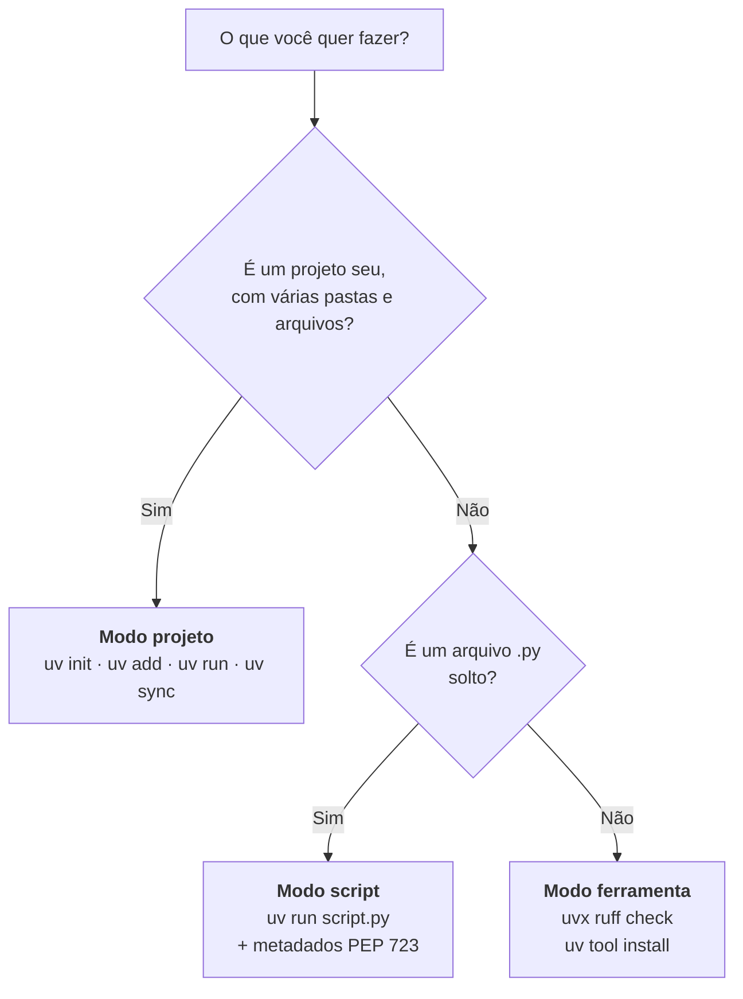
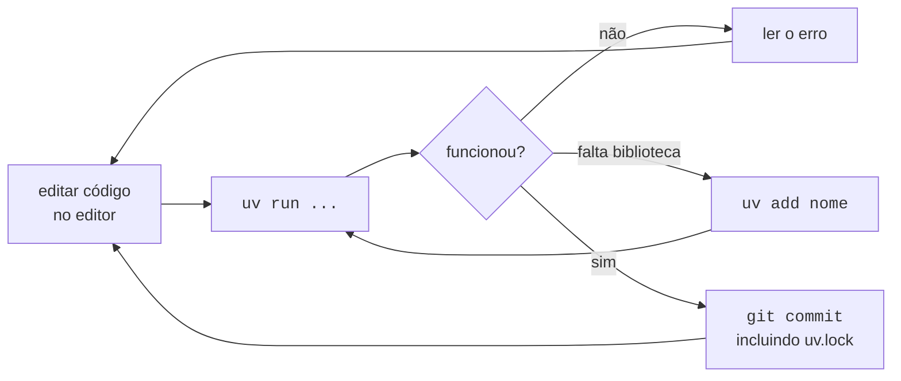

# 04 · Como começar — do ambiente pronto ao primeiro resultado

> **Nível:** iniciante · **Atualizado em:** 31/08/2026 · **uv 0.12.7**
> **Pré-requisito:** ter passado no checklist do [03-instalacao.md](03-instalacao.md#18-checklist-ambiente-pronto).
> Este arquivo **não repete a instalação**.

---

## 1. Os três modos de usar o uv

Antes de digitar qualquer coisa, entenda que existem três formas de trabalhar, e a
confusão entre elas é a maior fonte de erro dos primeiros dias:



| Modo | Você tem | Comando de entrada | O que o uv cria |
|---|---|---|---|
| **Projeto** | uma aplicação ou biblioteca | `uv init` | `pyproject.toml`, `uv.lock`, `.venv/` |
| **Script** | um arquivo `.py` solto | `uv run arquivo.py` | ambiente temporário, cacheado |
| **Ferramenta** | quer usar um programa (ruff, black, httpie) | `uvx NOME` | ambiente isolado, descartável ou permanente |

Comece pelo **modo projeto** — é onde você vai passar 90% do tempo.

---

## 2. O "olá mundo" mais curto que vale alguma coisa

Vamos fazer um programa que consulta uma API pública e mostra o resultado. Quatro
comandos, cerca de 30 segundos.

### Passo 1 — criar o projeto

```bash
uv init cotacao
```
Cria a pasta `cotacao` já com estrutura completa e um repositório Git inicializado.

```
Initialized project `cotacao` at `/caminho/atual/cotacao`
```

```bash
cd cotacao && ls -a
```
```
.git  .gitignore  .python-version  pyproject.toml  README.md  src
```

**O que cada arquivo é** (saída real do uv 0.12.7):

| Arquivo | Papel |
|---|---|
| `pyproject.toml` | **a declaração do projeto**: nome, versão, dependências. O único que você edita à mão com frequência |
| `.python-version` | a versão de Python fixada (`3.10` nesta máquina) |
| `src/cotacao/__init__.py` | seu código |
| `README.md` | vazio, para você preencher |
| `.gitignore` | já ignora `.venv/`, `__pycache__/`, `dist/` |
| `.git/` | repositório Git recém-criado |

Conteúdo do `pyproject.toml` gerado:

```toml
[project]
name = "cotacao"
version = "0.1.0"
description = "Add your description here"
readme = "README.md"
authors = [
    { name = "Seu Nome", email = "seu@email.com" }
]
requires-python = ">=3.10"
dependencies = []

[project.scripts]
cotacao = "cotacao:main"

[build-system]
requires = ["uv_build>=0.12.7,<0.13.0"]
build-backend = "uv_build"
```

> **Nota de versão:** até a série 0.6, `uv init` criava um `main.py` solto na raiz. A
> partir da 0.12 o padrão é o **layout `src/`** com o backend `uv_build`. Se um tutorial
> mais antigo falar de `main.py`, é isso que mudou — e mudou para melhor: o layout `src/`
> evita a classe de bug em que o teste importa a pasta local em vez do pacote instalado.

### Passo 2 — adicionar uma dependência

```bash
uv add requests
```
Resolve, trava a versão no `uv.lock`, cria o `.venv` e instala. Tudo num comando.

Saída real (medida nesta máquina em 31/08/2026):

```
Using CPython 3.10.12 interpreter at: /usr/bin/python3.10
Creating virtual environment at: .venv
Resolved 6 packages in 161ms
   Building cotacao @ file:///...
      Built cotacao @ file:///...
Prepared 5 packages in 81ms
Installed 6 packages in 33ms
 + certifi==2026.7.22
 + charset-normalizer==3.5.1
 + cotacao==0.1.0 (from file:///...)
 + idna==3.19
 + requests==2.34.2
 + urllib3==2.7.0
```

Repare em três coisas:

1. **Você não criou nem ativou ambiente virtual.** O uv fez.
2. Instalou 6 pacotes: `requests` e as 4 dependências dele — mais o **seu próprio
   projeto**, em modo editável. É por isso que `import cotacao` funciona de qualquer pasta.
3. Apareceram dois arquivos novos: `uv.lock` (a "nota fiscal" com versões e hashes) e
   a pasta `.venv/`.

E o `pyproject.toml` ganhou:

```toml
dependencies = [
    "requests>=2.34.2",
]
```

### Passo 3 — escrever o código

```bash
cat > src/cotacao/__init__.py <<'PY'
import requests


def main() -> None:
    """Busca a cotação do dólar comercial e imprime."""
    url = "https://economia.awesomeapi.com.br/last/USD-BRL"
    resposta = requests.get(url, timeout=10)
    resposta.raise_for_status()          # levanta erro se a API respondeu 4xx/5xx
    dado = resposta.json()["USDBRL"]
    print(f"Dólar comercial: R$ {float(dado['bid']):.4f}  ({dado['create_date']})")


if __name__ == "__main__":
    main()
PY
```
Cria o arquivo. Em vez do `cat`, você pode abrir no seu editor — dá no mesmo.

### Passo 4 — rodar

```bash
uv run cotacao
```
Executa o comando declarado em `[project.scripts]`. Antes de executar, o uv **verifica e
sincroniza o ambiente** automaticamente.

```
Dólar comercial: R$ 5.1820  (2026-08-31 17:27:19)
```
(Saída real desta máquina; o valor muda a cada execução, claro.)

Ou, equivalentemente:

```bash
uv run python -m cotacao
```

**Deu certo?** Você acabou de instalar uma dependência, travar sua versão e executar um
programa — sem tocar em `venv`, `activate` ou `pip`.

---

## 3. Verificação: como saber que está tudo em ordem

```bash
uv tree
```
Mostra a árvore de dependências. Saída real deste projeto:

```
Resolved 6 packages in 0.70ms
cotacao v0.1.0
└── requests v2.34.2
    ├── certifi v2026.7.22
    ├── charset-normalizer v3.5.1
    ├── idna v3.19
    └── urllib3 v2.7.0
```

```bash
uv run python -c "import sys; print(sys.executable)"
```
```
/caminho/atual/cotacao/.venv/bin/python
```
Confirma que o `uv run` usa o Python do `.venv` do projeto, não o do sistema.

```bash
head -3 uv.lock
```
```
version = 1
revision = 3
requires-python = ">=3.10"
```

---

## 4. O ciclo de trabalho do dia a dia



Na prática, são **cinco comandos** que cobrem quase tudo:

```bash
uv add PACOTE          # preciso de uma biblioteca nova
uv remove PACOTE       # não preciso mais
uv run COMANDO         # rodar qualquer coisa dentro do ambiente do projeto
uv sync                # trazer o ambiente ao estado do uv.lock (após git pull)
uv lock --upgrade      # atualizar as versões travadas, deliberadamente
```

### O comando que você mais vai usar sem perceber: `uv run`

`uv run` faz, sempre, **antes** de executar:

1. procura o `pyproject.toml` subindo os diretórios;
2. garante que o Python correto está instalado (baixa se preciso);
3. garante que o `uv.lock` está atualizado em relação ao `pyproject.toml`;
4. garante que o `.venv` reflete o `uv.lock`;
5. só então executa o comando dentro do ambiente.

Isso custa **milissegundos** quando não há nada a fazer — foi medido em 0,70 ms no
projeto acima. É por isso que dá para colocar `uv run` na frente de tudo sem culpa.

> **Consequência prática que muda seu hábito:** você pode parar de ativar ambientes.
> `source .venv/bin/activate` continua funcionando, mas ficou desnecessário. Prefixe
> tudo com `uv run` e nunca mais execute o programa errado no ambiente errado.

### Sincronizar depois de um `git pull`

```bash
git pull && uv sync
```
O colega adicionou uma dependência; `uv sync` põe o seu `.venv` exatamente no estado do
`uv.lock` — instalando o que falta e **removendo o que sobra**.

> `uv sync` é *destrutivo por desenho*: ele remove do `.venv` qualquer pacote que não
> esteja no lock. Isso é o que garante que "funciona na minha máquina" signifique alguma
> coisa. Se você instalou algo à mão com `uv pip install` e ele sumiu, foi isto.

### Ferramentas de qualidade, sem instalar nada

```bash
uv format
```
Formata o código com o Ruff (baixa o Ruff na primeira vez; ~10 MB).

```bash
uv check
```
Verifica tipos com o `ty` (baixa na primeira vez; ~12 MB).

```bash
uv audit
```
Procura vulnerabilidades conhecidas nas suas dependências.

Saída real (31/08/2026, projeto com `requests`):

```
warning: `uv audit` is experimental and may change without warning.
Resolved 6 packages in 0.71ms
Found no known vulnerabilities and no adverse project statuses in 5 packages
```

> Os três estão em **preview** na 0.12.7 — funcionam, mas as flags podem mudar. Silencie
> o aviso com `--preview-features audit-command` (ou `format-command`, `check-command`).

---

## 5. Modo script: um arquivo `.py` com dependências

Este é, na minha opinião, o recurso mais subestimado do uv. Ele resolve o problema de
"tenho um script de 30 linhas que precisa de duas bibliotecas e não quero criar um
projeto para isso".

```bash
cat > relatorio.py <<'PY'
# /// script
# requires-python = ">=3.11"
# dependencies = ["httpx"]
# ///
import httpx

print(httpx.get("https://example.com").status_code)
PY
```
O bloco de comentário no topo é o padrão **PEP 723** — metadados de script embutidos.

```bash
uv run relatorio.py
```
Saída real desta máquina, na primeira execução:

```
Downloading cpython-3.14.7-linux-x86_64-gnu (download) (34.3MiB)
 Downloaded cpython-3.14.7-linux-x86_64-gnu (download)
Installed 6 packages in 32ms
200
```

O uv leu o cabeçalho, viu que precisava de Python ≥ 3.11, **baixou o CPython 3.14.7**,
criou um ambiente efêmero, instalou o `httpx` e executou. Na segunda vez, tudo vem do
cache e é instantâneo.

Para deixar o uv escrever o cabeçalho por você:

```bash
uv init --script analise.py --python 3.12
uv add --script analise.py requests pandas
```
O primeiro cria o esqueleto; o segundo acrescenta as dependências ao bloco `# /// script`
já com versões mínimas resolvidas.

Verificação — o cabeçalho fica assim:

```python
# /// script
# requires-python = ">=3.12"
# dependencies = [
#     "requests>=2.34.2",
# ]
# ///
```

> **Por que isso importa:** você pode mandar **um único arquivo** para um colega, e ele
> roda com `uv run arquivo.py` sem instruções, sem `requirements.txt`, sem README. Se ele
> tiver uv, funciona. É a coisa mais próxima de um binário autocontido que o Python já teve.

---

## 6. Modo ferramenta: usar programas sem poluir nada

```bash
uvx ruff check .
```
Baixa o `ruff`, roda no diretório atual, descarta o ambiente. Nada fica instalado.

```bash
uvx --from httpie http GET https://example.com
```
Quando o nome do **pacote** difere do nome do **comando**, use `--from`.
(O pacote é `httpie`; o comando é `http`.)

```bash
uvx ruff@0.15.0 check .
```
Fixa a versão da ferramenta.

Se você usa a ferramenta todo dia, instale de vez:

```bash
uv tool install ruff
```
```
Installed 1 executable: ruff
```
```bash
uv tool list
# ruff v0.16.5
# - ruff
```

`uv tool` é o substituto direto do `pipx`, e é mais rápido.

---

## 7. Os cinco primeiros erros de uso (não de instalação)

### Erro 1 — `ModuleNotFoundError` mesmo depois de instalar

```
ModuleNotFoundError: No module named 'numpy'
```

**Causa:** você rodou `python script.py` em vez de `uv run script.py`, ou instalou com
`pip install` num ambiente que não é o do projeto.

**Correção:**
```bash
uv add numpy && uv run script.py
```

**Como confirmar de onde veio o problema:**
```bash
uv run python -c "import sys; print(sys.executable)"
```
Se não terminar em `.venv/bin/python` dentro do seu projeto, você está no ambiente errado.

### Erro 2 — usar `pip install` por hábito

```bash
pip install pandas
# error: externally-managed-environment
```

**Causa:** o `pip` global foi bloqueado pela distro (PEP 668) — e ainda bem.

**Correção:** `uv add pandas` (dentro de um projeto) ou `uv tool install <programa>`
(para ferramentas de linha de comando).

**Regra mental:** *biblioteca do projeto* → `uv add`. *Programa que você roda no
terminal* → `uv tool install` ou `uvx`.

### Erro 3 — editar o `pyproject.toml` à mão e o ambiente não mudar

Você acrescentou `"httpx>=0.28"` em `dependencies` e nada aconteceu.

**Causa:** editar o arquivo não instala nada. `uv run` e `uv sync` percebem a mudança e
resolvem — mas se você digitou um nome ou uma versão que não existe, a falha aparece na
hora e é confusa. Exemplo real produzido nesta máquina ao trocar `requests` por `httpx`
mantendo a versão antiga:

```
  ╰─▶ Because only httpx<=1.0.dev6 is available and your project depends on
      httpx>=2.34.2, we can conclude that your project's requirements are
      unsatisfiable.
```

**Correção:** prefira `uv add httpx` — ele descobre a versão certa sozinho. Edite à mão
só quando souber exatamente o que quer.

### Erro 4 — apagar o `.venv` achando que quebrou algo

Não é erro fatal, mas gera pânico desnecessário.

**Correção:**
```bash
uv sync
```
Reconstrói o ambiente inteiro a partir do `uv.lock`, idêntico ao que era. O `.venv` é
**descartável por desenho** — nunca guarde nada dentro dele.

### Erro 5 — esquecer de commitar o `uv.lock`

Sintoma: funciona na sua máquina, o colega recebe versões diferentes.

**Correção:**
```bash
git add pyproject.toml uv.lock .python-version && git commit -m "adiciona requests"
```

**Como se proteger no CI:**
```bash
uv sync --locked
```
Falha explicitamente se o lock estiver desatualizado, em vez de regerar em silêncio:

```
error: The lockfile at `uv.lock` needs to be updated, but `--locked` was provided
```

---

## 8. Cartão de referência dos primeiros dias

```bash
# criar
uv init nome                    # projeto (layout src/)
uv init --app nome              # aplicação
uv init --lib nome              # biblioteca (inclui py.typed)
uv init --script arq.py         # script único com PEP 723

# dependências
uv add pacote                   # adiciona
uv add "pacote>=2,<3"           # com faixa de versão
uv add --dev pytest             # só para desenvolvimento
uv remove pacote                # remove
uv tree                         # ver a árvore

# executar
uv run programa                 # comando do [project.scripts]
uv run python arquivo.py        # um arquivo
uv run --with rich python       # com uma dependência extra, sem adicionar ao projeto
uv run -m pytest                # um módulo

# ambiente
uv sync                         # ambiente = uv.lock
uv sync --locked                # igual, mas falha se o lock estiver velho (use no CI)
uv lock --upgrade               # atualizar as versões travadas

# python
uv python install 3.13
uv python pin 3.13
uv python list

# ferramentas
uvx ruff check .                # rodar sem instalar
uv tool install ruff            # instalar de vez
uv tool list
```

---

## 9. Para onde ir agora

| Você quer | Vá para |
|---|---|
| A referência completa de comandos e flags | [05-manual-de-uso.md](05-manual-de-uso.md) |
| Ver 14 receitas prontas, do trivial ao de produção | [06-exemplos.md](06-exemplos.md) |
| Estudar uma aplicação inteira que roda de verdade | [07-projeto-modelo/](07-projeto-modelo/README.md) |
| Entender *por que* funciona assim | [10-fundamentos.md](10-fundamentos.md) |
| Migrar um projeto que já existe (pip, Poetry, conda) | [20-migracao-de-pip-poetry-conda.md](20-migracao-de-pip-poetry-conda.md) |

---

## Autoteste

1. Quais são os três modos de uso do uv, e como você decide qual usar?
2. O que `uv run` faz **antes** de executar o comando? Cite os cinco passos.
3. Por que você não precisa mais de `source .venv/bin/activate`?
4. `uv sync` remove pacotes do `.venv`. Isso é bug ou recurso? Justifique.
5. Escreva o cabeçalho PEP 723 de um script que precisa de Python ≥ 3.12 e de `polars`.
6. Qual a diferença entre `uvx ruff` e `uv tool install ruff`?
7. Você recebe `ModuleNotFoundError` para um pacote que acabou de adicionar. Qual é o
   primeiro comando de diagnóstico?
8. Qual flag usar no CI para garantir que ninguém esqueceu de commitar o `uv.lock`?
9. Por que `uv add httpx` é preferível a editar o `pyproject.toml` à mão?

---

**Fontes:** comandos e saídas executados localmente em 31/08/2026 (uv 0.12.7, Ubuntu
22.04.5); [docs.astral.sh/uv/guides](https://docs.astral.sh/uv/guides/);
[PEP 723](https://peps.python.org/pep-0723/).

**Próximo:** [05-manual-de-uso.md](05-manual-de-uso.md)
