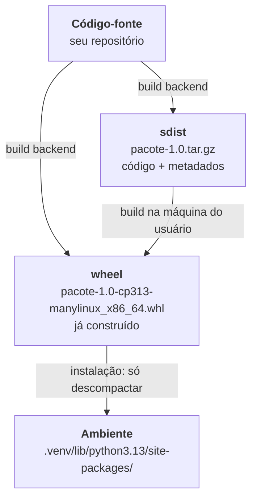
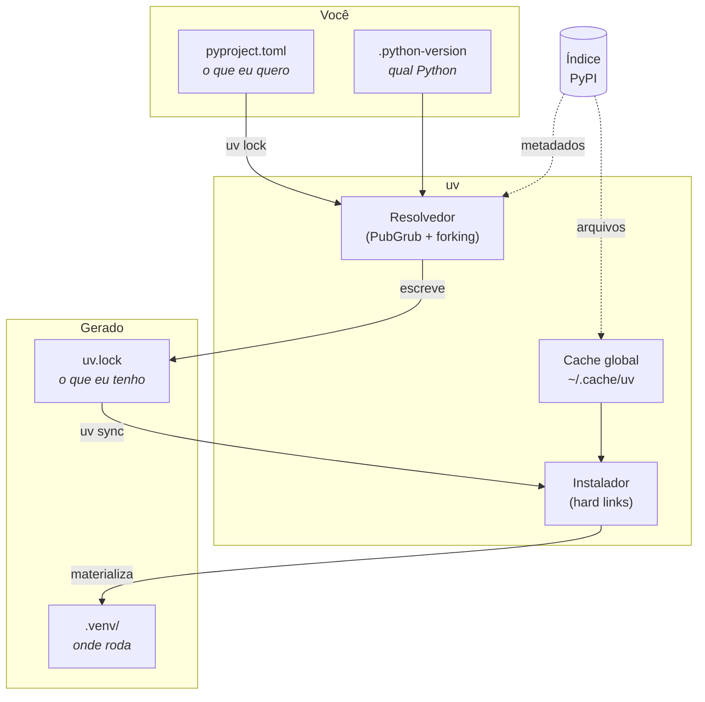

# 10 · Fundamentos — o vocabulário e os modelos mentais

> **Nível:** intermediário · **Atualizado em:** 31/08/2026

Este é o arquivo que transforma "sei os comandos" em "entendo o que está acontecendo".
Todo termo usado no resto do curso é definido aqui.

---

## 1. O problema fundamental do empacotamento

Reduzido ao essencial, todo gerenciador de pacotes resolve **quatro problemas**, e é
útil vê-los separados porque as ferramentas antigas resolviam um ou dois cada:

| Problema | Pergunta | Quem resolvia antes | No uv |
|---|---|---|---|
| **Isolamento** | onde este código roda, sem atrapalhar outro? | `virtualenv`, `venv` | `.venv` automático |
| **Resolução** | quais versões exatas satisfazem todas as restrições? | `pip`, `pip-tools`, `poetry` | resolvedor PubGrub com forking |
| **Aquisição** | como baixar e colocar os arquivos no lugar? | `pip` | downloader paralelo + cache global |
| **Reprodução** | como obter o **mesmo** ambiente amanhã, em outra máquina? | `pip freeze`, `poetry.lock`, `Pipfile.lock` | `uv.lock` universal |

O uv resolve os quatro **em um binário só**. Essa é a tese do projeto, e todo o resto
decorre disso.

---

## 2. Vocabulário essencial

### 2.1 A pilha de artefatos



| Termo | Definição | Por que importa |
|---|---|---|
| **Distribuição** (*distribution*) | o pacote publicável. **Não** é o mesmo que o nome do módulo importado | você instala `pillow` e importa `PIL`; instala `scikit-learn` e importa `sklearn` |
| **sdist** (*source distribution*) | `.tar.gz` com o código-fonte e um jeito de construí-lo | precisa ser **construído** na sua máquina: lento e pode falhar |
| **wheel** | `.whl`, um ZIP com os arquivos já no lugar final (PEP 427) | instalar = descompactar. É a razão de o Python moderno ser rápido de instalar |
| **Tag de wheel** | `cp313-cp313-manylinux_2_28_x86_64` = Python 3.13 CPython, Linux glibc 2.28+, x86-64 | é o que decide se o wheel serve para você |
| **`manylinux`** | perfil que define quais bibliotecas de sistema o wheel pode usar (PEP 600) | permite um wheel funcionar em várias distros Linux |
| **`py3-none-any`** | wheel puro Python, serve em qualquer lugar | o caso feliz: sem compilação, sem plataforma |
| **Índice** (*index*) | servidor que lista pacotes (o PyPI é o público) | a "loja" de onde vêm os pacotes |
| **PyPI** | *Python Package Index*, `pypi.org` — o índice público oficial | ~600 mil projetos |
| **Ambiente virtual** | diretório com um Python e um `site-packages` próprios (PEP 405) | o isolamento |
| **`site-packages`** | pasta onde os pacotes instalados ficam | onde o `import` procura |
| **Lockfile** | arquivo com as versões e hashes exatos de tudo | a reprodutibilidade |
| **Resolvedor** | algoritmo que escolhe versões compatíveis | onde mora a dificuldade real |

### 2.2 Restrições de versão (PEP 440 e PEP 508)

```
requests                 qualquer versão
requests>=2.31           2.31 ou maior
requests>=2.31,<3        faixa: "compatível com a série 2"
requests~=2.31.0         "compatível": >=2.31.0, <2.32.0
requests==2.34.2         exatamente esta
requests==2.34.*         qualquer patch da 2.34
requests!=2.32.0         qualquer uma, menos essa (uma versão com bug conhecido)
requests===2.34.2        igualdade literal de string (raríssimo; foge do PEP 440)
```

O **especificador completo** da PEP 508 junta nome, extras, versão e marcador:

```
requests[socks]>=2.31 ; python_version >= "3.11" and sys_platform != "win32"
└──┬───┘└─┬──┘└──┬───┘   └──────────────────┬──────────────────────────────┘
  nome  extras  versão                  marcador de ambiente
```

**Marcadores de ambiente** são a peça que torna a resolução universal possível.
Os que você vai encontrar:

| Marcador | Valores típicos |
|---|---|
| `python_version` | `"3.10"`, `"3.13"` |
| `python_full_version` | `"3.13.2"` |
| `sys_platform` | `"linux"`, `"darwin"`, `"win32"` |
| `platform_machine` | `"x86_64"`, `"aarch64"`, `"arm64"`, `"AMD64"` |
| `platform_system` | `"Linux"`, `"Darwin"`, `"Windows"` |
| `implementation_name` | `"cpython"`, `"pypy"` |
| `extra` | usado internamente para extras |

### 2.3 Versionamento

**PEP 440** é o padrão do Python, e **não** é SemVer, embora se pareça:

```
1.2.3           release normal
1.2.3.post1     correção de empacotamento, sem mudar o código
1.2.3.dev4      desenvolvimento
1.2.3a1         alpha (pré-lançamento)
1.2.3b2         beta
1.2.3rc1        release candidate
1!2.0.0         "epoch" 1 — usado quando o esquema de versão inteiro muda
2026.7.22       versionamento por data (calver) — o `certifi` usa
```

**Ordenação:** `1.2.3.dev1 < 1.2.3a1 < 1.2.3b1 < 1.2.3rc1 < 1.2.3 < 1.2.3.post1`.

> **Armadilha:** por padrão, resolvedores **não** escolhem pré-lançamentos. Se
> `pacote` só tiver versões `2.0.0b1`, você recebe "nenhuma versão encontrada" mesmo
> vendo a versão no PyPI. Ver `--prerelease` no [05-manual-de-uso](05-manual-de-uso.md).

---

## 3. O modelo mental do uv em uma figura



**As três camadas, e por que a distinção é o conceito central do curso:**

| Camada | Arquivo | Natureza | Versionar? |
|---|---|---|---|
| **Declaração** | `pyproject.toml` | o que você **quer** — faixas, intenção | ✅ |
| **Resolução** | `uv.lock` | o que o resolvedor **decidiu** — versões e hashes exatos, para *todas* as plataformas | ✅ |
| **Materialização** | `.venv/` | o que existe **nesta máquina agora** — uma plataforma só | ❌ |

Cada seta é um comando: `uv lock` faz declaração → resolução; `uv sync` faz resolução →
materialização. `uv add` e `uv run` fazem as duas quando necessário.

> **Se você guardar uma única ideia deste curso, guarde esta tabela.** Todos os erros
> confusos de uv vêm de confundir as camadas: editar o lock à mão, versionar o `.venv`,
> instalar no `.venv` com `pip` por fora, esperar que editar o `pyproject.toml` mude o
> ambiente sozinho.

---

## 4. O que é um ambiente virtual, por dentro

Um `.venv` não tem mágica nenhuma. Ele é:

```
.venv/
├── pyvenv.cfg               # 3 linhas de texto: onde está o Python "real"
├── bin/                     # Scripts/ no Windows
│   ├── python -> /home/voce/.local/share/uv/python/cpython-3.13.../bin/python3.13
│   ├── pytest               # scripts dos pacotes instalados
│   └── activate             # apenas edita PATH e PS1 do shell
└── lib/python3.13/site-packages/
    ├── requests/
    └── requests-2.34.2.dist-info/   # metadados: RECORD, METADATA, WHEEL
```

`pyvenv.cfg` real de um `.venv` criado pelo uv:

```ini
home = /usr/bin
implementation = CPython
version_info = 3.10.12
uv = 0.12.7
include-system-site-packages = false
relocatable = false
```

**Como o isolamento funciona, mecanicamente:** ao iniciar, o `python` do `.venv` procura
um `pyvenv.cfg` ao lado ou um nível acima do executável. Achando, define `sys.prefix`
para o diretório do `.venv` e monta o `sys.path` a partir dali, **sem** o `site-packages`
global. É só isso. Nenhum container, nenhum namespace, nenhuma proteção. É uma convenção
de caminhos.

**Consequências que explicam bugs reais:**

- Apagar o `.venv` não quebra nada permanentemente — `uv sync` recria.
- Copiar um `.venv` para outra máquina **não funciona**: os caminhos absolutos em
  `pyvenv.cfg` e nos *shebangs* dos scripts apontam para o Python da máquina de origem.
- Renomear a pasta do projeto quebra o `.venv` pelo mesmo motivo. Solução: `uv sync`.
- `activate` não é obrigatório para nada: rodar `.venv/bin/python` direto tem o mesmo
  efeito. `uv run` faz exatamente isso.

---

## 5. Como um `import` acha um pacote

Cinco porquês aplicados à pergunta "por que meu `import` falhou?".

**1. Por que `import requests` funciona?**
Porque existe `requests/__init__.py` em algum diretório de `sys.path`.

**2. Por que `sys.path` contém aquele diretório?**
Porque, ao iniciar, o módulo `site` acrescenta o `site-packages` correspondente ao
`sys.prefix`, que veio do `pyvenv.cfg`.

**3. Por que o Python usa uma lista de caminhos, e não um registro central de pacotes?**
**Decisão histórica documentada:** o modelo de import do Python é de 1991 e foi
copiado do que Perl e Tcl faziam — uma lista de diretórios de busca. Não havia
gerenciador de pacotes; o `distutils` só apareceu em 2000 e o PyPI em 2003.

**4. Por que isso nunca foi trocado por algo melhor?**
Porque `sys.path` é **API pública** de que dezenas de milhares de projetos dependem
(plugins, ferramentas de empacotamento, frameworks que injetam caminhos). Trocar
quebraria o ecossistema inteiro. **Trade-off explícito:** a comunidade escolheu,
repetidas vezes, compatibilidade em vez de elegância.

**5. Por que o `.venv` é a solução, e não algo como o `node_modules`?**
Porque o `node_modules` funciona graças a um algoritmo de resolução **por diretório**
embutido no runtime do Node — o Python não tem isso, e acrescentá-lo exigiria mudar o
interpretador. O `.venv` consegue o mesmo efeito **sem tocar no interpretador**, usando
só a variável `sys.prefix` que já existia.
**Parada legítima: decisão de projeto documentada na PEP 405 (2012), com o
custo-benefício explicitado no próprio texto da PEP.**

---

## 6. Por que o uv é rápido — as cinco razões, sem marketing

Medição real desta máquina, 31/08/2026, instalando `fastapi` + `pandas`:
`pip` **23,5 s** · `uv` sem cache **3,6 s** · `uv` com cache **3,0 s**.

| Razão | O que muda | Peso |
|---|---|---|
| **1. Rust em vez de Python** | o próprio resolvedor não paga o custo do interpretador; sem tempo de inicialização | moderado |
| **2. Paralelismo agressivo** | baixa metadados de dezenas de pacotes ao mesmo tempo; o `pip` é essencialmente sequencial | **grande** |
| **3. Metadados sem baixar o arquivo inteiro** | usa `Range` de HTTP para ler só o `METADATA` de dentro do ZIP do wheel (PEP 658 quando o índice oferece) | **grande** |
| **4. Cache global com hard links** | instalar = criar links, não copiar bytes. Recriar um ambiente conhecido é quase instantâneo | **enorme** (só com cache) |
| **5. Resolvedor PubGrub** | menos retrocesso que o algoritmo do `pip`, e erros explicáveis | grande em casos difíceis |

> **Honestidade sobre os números de propaganda:** "10–100× mais rápido" é verdade **com
> cache quente**, medindo a recriação de um ambiente já conhecido. Numa instalação
> genuinamente nova, dominada pelo download, o ganho fica na casa de 5–10×, como no meu
> teste. Ambos os números são reais; eles medem coisas diferentes. Desconfie de quem cita
> um sem dizer qual.

---

## 7. O ecossistema de padrões (as PEPs que você precisa conhecer)

O uv não inventou formato nenhum. Ele **implementa padrões**, e isso é deliberado — é o
que permite conviver com pip, Poetry e Hatch.

| PEP | Ano | O que definiu | Onde você vê |
|---|---|---|---|
| **PEP 405** | 2012 | ambientes virtuais | `.venv/`, `pyvenv.cfg` |
| **PEP 427** | 2012 | formato wheel | os `.whl` |
| **PEP 440** | 2013 | esquema de versões | `>=2.31,<3` |
| **PEP 503** | 2015 | *Simple Repository API* e normalização de nomes | `pypi.org/simple/` |
| **PEP 508** | 2015 | especificação de dependência com marcadores | `pacote ; sys_platform=='linux'` |
| **PEP 517/518** | 2017 | build backend plugável e `[build-system]` | `build-backend = "uv_build"` |
| **PEP 600** | 2019 | `manylinux` por versão de glibc | `manylinux_2_28_x86_64` |
| **PEP 621** | 2020 | metadados do projeto em `[project]` | seu `pyproject.toml` |
| **PEP 658** | 2021 | metadados servidos separados do wheel | por que o uv é rápido |
| **PEP 668** | 2022 | ambientes "gerenciados externamente" | o erro do `pip` global |
| **PEP 680** | 2022 | `tomllib` na biblioteca padrão | ler `pyproject.toml` sem dependência |
| **PEP 703** | 2023 | CPython sem GIL (opcional) | `3.14t`, `+freethreaded` |
| **PEP 723** | 2023 | metadados embutidos em scripts | o bloco `# /// script` |
| **PEP 735** | 2024 | grupos de dependências | `[dependency-groups]` |
| **PEP 751** | 2025 | lockfile **padronizado** (`pylock.toml`) | `uv export --format pylock.toml` |

> **O ponto político importante:** o `uv.lock` é um formato **próprio** do uv, não um
> padrão. A PEP 751 criou o `pylock.toml` justamente para acabar com essa fragmentação
> (`poetry.lock`, `Pipfile.lock`, `pdm.lock`, `uv.lock`). O uv **exporta** para
> `pylock.toml`, mas ainda não o usa como formato nativo — porque o `pylock.toml`
> ainda não representa tudo que o `uv.lock` representa (grupos, workspaces, conflitos).
> Este é um debate aberto em 2026; ver [65-estado-da-arte](65-estado-da-arte.md).

---

## 8. Os quatro contextos de instalação — e onde cada coisa mora

Confundir estes quatro é a origem de metade das dúvidas:

| Contexto | Onde os pacotes vão | Comando | Quando |
|---|---|---|---|
| **Projeto** | `<projeto>/.venv/` | `uv add`, `uv sync` | seu código |
| **Ferramenta** | `~/.local/share/uv/tools/<nome>/` | `uv tool install` | programas de terminal |
| **Script** | ambiente efêmero em cache | `uv run script.py` | arquivo único PEP 723 |
| **Sistema** | `/usr/lib/python3/dist-packages` | ❌ não faça | só o gerenciador do SO |

Um mapa dos diretórios (caminhos reais desta máquina, Linux):

```
~/.local/bin/uv                        o binário
~/.local/bin/uvx                       atalho para `uv tool run`
~/.cache/uv/                           cache global (207 MiB aqui)
~/.local/share/uv/python/              interpretadores gerenciados
~/.local/share/uv/tools/               ambientes das ferramentas
~/.config/uv/uv.toml                   configuração do usuário
<projeto>/.venv/                       ambiente do projeto
```

No macOS, `~/.local/share/uv` vira `~/Library/Application Support/uv` em algumas
versões; no Windows, `%LOCALAPPDATA%\uv`. Use sempre `uv cache dir`, `uv python dir` e
`uv tool dir` em vez de decorar caminhos.

---

## Autoteste

1. Quais são os quatro problemas que todo gerenciador de pacotes resolve? Diga qual
   ferramenta antiga resolvia cada um.
2. Qual a diferença entre sdist e wheel, e por que ela domina o tempo de instalação?
3. Decomponha `flask[async]>=3.0 ; python_version >= "3.11"` em suas quatro partes.
4. Explique as três camadas (declaração / resolução / materialização) e diga qual
   arquivo corresponde a cada uma. Quais vão para o Git?
5. Por que copiar um `.venv` para outra máquina não funciona?
6. Como funciona, mecanicamente, o isolamento de um ambiente virtual? Cite `pyvenv.cfg`.
7. Cite as cinco razões da velocidade do uv e diga qual delas explica o número
   "100× mais rápido".
8. Por que o `uv.lock` não é um padrão, e o que a PEP 751 tenta resolver?
9. Onde ficam os pacotes de uma ferramenta instalada com `uv tool install` — e por que
   não no `.venv` do seu projeto?
10. Ordene: `1.2.3rc1`, `1.2.3.post1`, `1.2.3.dev1`, `1.2.3`, `1.2.3b2`.

---

**Fontes:** [PEPs citadas em peps.python.org](https://peps.python.org/) ·
[packaging.python.org](https://packaging.python.org/) ·
[docs.astral.sh/uv/reference/internals/resolver](https://docs.astral.sh/uv/reference/internals/resolver/) ·
medições e saídas locais de 31/08/2026 (uv 0.12.7).

**Próximo:** [11-historia.md](11-historia.md)
