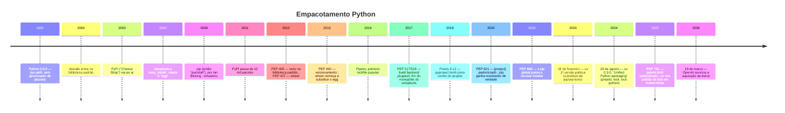

# 11 · História — como chegamos aqui, e por que demorou tanto

> **Nível:** intermediário · **Atualizado em:** 31/08/2026

Ninguém entende o uv sem entender o buraco de trinta anos que ele preenche. Esta é a
história do empacotamento Python contada por alguém que viveu a maior parte dela — com
as datas conferidas.

---

## 1. Linha do tempo

---

## 2. A era sem ferramentas (1991–2003)

No começo não havia empacotamento. Você baixava um `.tar.gz`, descompactava e copiava a
pasta para dentro de `sys.path`. Bibliotecas circulavam por FTP e listas de e-mail.

**O `distutils` (2000)** foi a primeira tentativa: um módulo da biblioteca padrão com um
comando `python setup.py install`. Ele resolvia *instalar*, e nada mais — não sabia
baixar, não sabia versões, não sabia desinstalar.

**O PyPI (2003)**, apelidado *Cheese Shop* (piada do Monty Python), deu um lugar central
para publicar. Mas ainda não havia cliente decente para consumir.

> **O pecado original:** `setup.py` é **código Python executado** para descobrir os
> metadados do pacote. Para saber de que o pacote X depende, era preciso **executar um
> script arbitrário do autor do pacote**. Isso é lento (um processo Python por consulta),
> inseguro (código arbitrário na sua máquina) e impossível de paralelizar bem.
> Praticamente todos os problemas de desempenho do `pip` descendem daqui — e é por isso
> que o `pip` era lento por natureza, não por descuido.

---

## 3. A era do `easy_install` e do egg (2004–2008)

O **setuptools** de Phillip J. Eby estendeu o `distutils` e trouxe o `easy_install`:
finalmente dava para baixar do PyPI com um comando. Trouxe também o formato **egg**.

E trouxe traumas que marcaram uma geração:

- não sabia **desinstalar**;
- escrevia num arquivo `easy-install.pth` global que reordenava o `sys.path` de formas
  surpreendentes;
- misturava pacotes de origens diferentes no mesmo diretório;
- o *namespace package* do setuptools era uma fonte inesgotável de bugs sutis.

---

## 4. `pip` e `virtualenv` (2008–2012): a dupla que durou 15 anos

**Ian Bicking** escreveu as duas peças que definiriam a década:

- **`pip`** (2008) — "pip installs packages". Sabia desinstalar, tinha
  `requirements.txt`, era compreensível.
- **`virtualenv`** (2007) — a pasta que finge ser uma instalação de Python.

A combinação `virtualenv` + `pip` + `requirements.txt` virou **o** jeito de fazer Python,
e assim ficou até pouquíssimo tempo atrás. Funcionava. Mas tinha três buracos que só
apareceram com o tempo:

1. **`requirements.txt` não é lockfile.** Não tem hashes, não distingue "o que eu pedi"
   de "o que foi instalado", não guarda dependências transitivas de forma confiável.
2. **`pip` não tinha resolvedor.** Até 2020 ele instalava na ordem em que encontrava e
   simplesmente sobrescrevia conflitos. Você podia acabar com um ambiente **inconsistente**
   e o `pip` não reclamava.
3. **Nada gerenciava o Python em si.** Você precisava de `pyenv` (2013) para isso.

**O `venv` na biblioteca padrão (PEP 405, 2012)** oficializou a ideia, e o `wheel`
(PEP 427, 2012) matou o egg — instalar virou descompactar, e o Python ficou muito mais
rápido de instalar sem que ninguém precisasse mudar de ferramenta.

---

## 5. A explosão cambriana (2016–2020)

Todo mundo percebeu os buracos ao mesmo tempo, e cada um construiu sua solução:

| Ferramenta | Ano | Ideia central | O que aconteceu |
|---|---|---|---|
| **conda** | 2012 | gerenciar também bibliotecas C/Fortran e o próprio Python | dominou o mundo científico; ecossistema paralelo ao PyPI |
| **Pipenv** | 2016 | `Pipfile` + `Pipfile.lock`, apadrinhado pela PyPA | prometeu demais, entregou devagar; perdeu confiança |
| **Poetry** | 2018 | `pyproject.toml` como centro, lock, build e publish num só | virou o favorito da comunidade por anos |
| **pip-tools** | 2016 | `pip-compile` gera `requirements.txt` travado a partir de `.in` | simples e sólido; o "lock do pobre" que muita gente prefere até hoje |
| **PDM** | 2019 | PEP 582 (`__pypackages__`, sem venv) + padrões modernos | tecnicamente elegante; a PEP 582 foi rejeitada em 2023 |
| **Hatch** | 2022 | ambientes de matriz + build backend próprio | forte no build; adotado pela PyPA |

**As duas PEPs que mudaram tudo nessa fase:**

- **PEP 517/518 (2017)** — permitiram declarar em `pyproject.toml` **qual programa**
  constrói o seu pacote. O `setuptools` deixou de ser obrigatório. Sem isso, `uv_build`,
  `hatchling`, `flit` e `maturin` não existiriam.
- **PEP 621 (2020)** — padronizou `[project]` no `pyproject.toml`. É por isso que hoje
  um projeto Poetry moderno e um projeto uv têm o mesmo `[project]`, e migrar é barato.

**Em 2020 o `pip` finalmente ganhou um resolvedor de verdade** (backtracking). Foi uma
mudança enorme — e deixou o `pip` ainda mais lento, porque agora ele precisava baixar e
inspecionar candidatos para retroceder.

---

## 6. O estado do mundo em 2023: por que havia espaço para o uv

Se você começasse um projeto Python em 2023, precisava decidir:

- qual gerenciador de versão do Python (`pyenv`? `asdf`? o do sistema? `conda`?);
- qual ferramenta de ambiente (`venv`? `virtualenv`? `conda`?);
- qual gerenciador de dependências (`pip`? `pip-tools`? `poetry`? `pdm`? `pipenv`?);
- qual formato de lock (nenhum? `requirements.txt`? `poetry.lock`?);
- qual build backend (`setuptools`? `hatchling`? `flit`?);
- como instalar ferramentas de terminal (`pipx`? global? um venv por ferramenta?).

Seis decisões, cada uma com três a cinco opções, sem consenso, com tutoriais
contraditórios. Compare com Rust (`cargo`), Go (`go mod`) ou Node (`npm`), onde a
resposta é uma só e vem na caixa.

**Essa era a dor.** E é por isso que o uv pegou tão rápido: ele não vendeu velocidade,
vendeu **o fim das seis decisões**.

---

## 7. A entrada do uv (2024)

### 15 de fevereiro de 2024 — o lançamento

A Astral — empresa de Charlie Marsh, que já tinha feito o **Ruff** (linter em Rust,
10–100× mais rápido que o `flake8`) — publicou o post *"uv: Python packaging in Rust"*.

O escopo inicial era **modesto e cirúrgico**: um substituto compatível para `pip` e
`pip-tools`. Nada de projeto, nada de lock próprio, nada de gerenciar Python.

Os números anunciados: **8–10× mais rápido** que `pip` sem cache, **80–115× mais rápido**
com cache quente, e criação de ambiente virtual **~80× mais rápida** que `python -m venv`.

E a ambição declarada, no mesmo post: construir **"o Cargo do Python"** — um binário
único que substituísse `pip`, `pip-tools`, `virtualenv`, `pipx`, `tox`, `poetry`,
`pyenv` e `ruff`.

> **Por que começar pequeno funcionou** (opinião profissional): o `pip` tem duas décadas
> de comportamento memorizado por milhões de pessoas e por dezenas de milhares de
> scripts de CI. Ao entrar como *substituto compatível*, o uv pôde ser adotado num
> `sed s/pip/uv pip/` — risco quase zero. As ferramentas que exigiram conversão total do
> projeto (Pipenv, PDM) enfrentaram resistência muito maior. Esta é a lição de estratégia
> mais importante da história recente do ecossistema.

### 20 de agosto de 2024 — a versão 0.3.0

Seis meses depois, a segunda metade do plano: *"uv: Unified Python packaging"*. De uma
vez, o uv ganhou:

- **gerenciamento de projeto**: `uv init`, `uv add`, `uv remove`, `uv sync`;
- **lockfile próprio e universal**: `uv.lock`, resolvido para todas as plataformas;
- **gerenciamento de Python**: `uv python install` — substituindo o `pyenv`;
- **ferramentas**: `uv tool` / `uvx` — substituindo o `pipx`;
- **workspaces**, copiados descaradamente (e bem) do Cargo;
- **scripts com PEP 723**.

Foi o momento em que o uv deixou de ser "um pip rápido" e virou uma proposta de
substituir a pilha inteira.

### 2025 — a virada de adoção

Ao longo de 2025, o uv passou de curiosidade a padrão de fato em uma parte grande da
indústria: documentação oficial de projetos grandes passou a mostrar `uv` como primeira
opção, imagens Docker oficiais apareceram, o `setup-uv` virou rotina em CI. No mesmo
período a Astral lançou o **`ty`** (verificador de tipos em Rust) e, em agosto de 2025,
o **`pyx`** — um registro de pacotes comercial, a tentativa de monetização.

### 19 de março de 2026 — a OpenAI compra a Astral

A OpenAI anunciou a aquisição da Astral, com a equipe integrando o time do **Codex**.
Charlie Marsh declarou que `uv`, `ruff` e `ty` permanecem abertos e sob licença
MIT/Apache-2.0. Não houve anúncio de transferência para fundação, comitê independente de
mantenedores ou qualquer estrutura formal de governança.

Em seguida, o **`pyx` foi descontinuado** — o serviço encerrado e a infraestrutura de
índice para GPU e wheels pré-construídos aberta em código livre.

**O que isso significa, com honestidade:**

| Fato | Interpretação otimista | Interpretação pessimista |
|---|---|---|
| Equipe na OpenAI | mais recursos, cadência mantida (e ela foi mantida: a 0.12.7 saiu em 27/08/2026) | roadmap passa a servir às necessidades internas do Codex |
| Licença MIT/Apache mantida | um fork é sempre possível; ninguém pode "fechar" o que já é aberto | licença não impede o projeto de ser abandonado ou desviado |
| `pyx` encerrado | acabou o conflito "open core"; o produto pago não existe mais | mostra que a estratégia comercial original não vingou |
| Sem estrutura de governança | a equipe original continua no comando, e ela é boa | não há mecanismo institucional se a prioridade mudar |

**Minha posição, marcada como opinião:** eu continuo recomendando o uv, e uso em
produção. O risco real não é o uv "fechar" — a licença impede. O risco é **estagnação
ou desvio de rumo** em dois ou três anos. A mitigação prática é barata e você deve
adotá-la de qualquer forma: mantenha o `pyproject.toml` **padrão** (PEP 621, sem
depender de extensões só do uv onde houver alternativa), e saiba que
`uv export --format pylock.toml` ou `requirements.txt` te dá uma porta de saída em um
comando. Ver [80-custos-e-licencas](80-custos-e-licencas.md).

---

## 8. Os cinco porquês: por que o Python demorou tanto?

**1. Por que o Python não teve um `cargo` desde cedo?**
Porque quando o Python nasceu (1991), gerenciadores de pacote de linguagem não existiam
como categoria. O CPAN do Perl, o primeiro grande, é de 1995.

**2. Por que não copiaram o CPAN, então?**
Porque a cultura Python era de "baterias inclusas": a resposta oficial a "preciso de X"
era colocar X na biblioteca padrão. Isso adiou por uma década a necessidade sentida de
um gerenciador externo — e criou uma biblioteca padrão enorme que hoje é meio-obsoleta.

**3. Por que, quando enfim precisaram, saíram sete ferramentas em vez de uma?**
Porque a **governança** do Python não tinha (e ainda não tem) autoridade sobre
ferramentas. A PyPA é uma associação voluntária de projetos, não uma equipe com poder de
decidir. Cada mantenedor com uma boa ideia podia — e devia — publicá-la.
**Parada legítima: é uma consequência estrutural do modelo de governança, documentada
nas discussões de "packaging strategy" do Discourse do Python desde 2022.**

**4. Por que a fragmentação persistiu mesmo com todos reclamando?**
**Trade-off econômico explícito:** unificar exigiria uma equipe paga trabalhando em
tempo integral por anos. Nenhum dos projetos tinha isso — eram todos voluntários ou
projetos paralelos. A PSF nunca teve orçamento para bancar uma equipe de empacotamento.

**5. Por que o uv conseguiu, então?**
Porque a Astral era uma **empresa com capital de risco**, com engenheiros em tempo
integral e sem obrigação de consenso comunitário. Ela pôde fazer o que a comunidade não
conseguia: escolher, executar rápido e cobrir a superfície inteira.
**Este é o ponto desconfortável e honesto da história:** o problema não era técnico nem
de falta de ideias — era de **financiamento e coordenação**. Foi resolvido por dinheiro
privado, o que explica tanto a velocidade quanto o desconforto de parte da comunidade
com a dependência de um ator comercial. A aquisição de 2026 é exatamente a materialização
desse desconforto.

---

## 9. O que aprender com esta história

1. **Compatibilidade é a estratégia de adoção mais poderosa que existe.** O uv entrou
   como `uv pip`.
2. **Padrões abertos permitem substituição.** Como o uv implementa PEP 621, 508, 440 e
   517, migrar *para* ele e *dele* é barato. Isso é seu seguro.
3. **Velocidade é o gancho; unificação é o valor.** Ninguém troca de ferramenta por 3 s.
   As pessoas trocam para parar de tomar seis decisões.
4. **Ferramenta de infraestrutura sem financiamento estagna.** Vale para o Python e vale
   para o que você constrói.
5. **`setup.py` executável foi um erro de projeto que custou 20 anos de lentidão.**
   Metadados devem ser **declarativos**. É a lição técnica mais transferível daqui.

---

## Autoteste

1. Por que `setup.py` ser código executável tornou o `pip` estruturalmente lento?
2. Qual a diferença essencial entre `requirements.txt` e um lockfile?
3. O que a PEP 517/518 permitiu que antes era impossível?
4. Cite as seis decisões que quem começava um projeto Python em 2023 tinha de tomar.
5. Por que o uv começou como substituto do `pip` em vez de já lançar o modo projeto?
6. O que mudou na versão 0.3.0, em agosto de 2024?
7. Explique, pelos cinco porquês, por que o Python fragmentou em sete ferramentas.
8. Qual é o risco real da aquisição pela OpenAI — e qual a mitigação prática de um comando?
9. Qual PEP foi rejeitada e que ferramenta apostava nela?
10. Que lição de projeto de software você tira do `setup.py`?

---

**Fontes (consultadas em 31/08/2026):**
[astral.sh/blog/uv](https://astral.sh/blog/uv) (15/02/2024) ·
[astral.sh/blog/uv-unified-python-packaging](https://astral.sh/blog/uv-unified-python-packaging) (20/08/2024) ·
[openai.com/index/openai-to-acquire-astral](https://openai.com/index/openai-to-acquire-astral/) (19/03/2026) ·
[simonwillison.net/2026/mar/19/openai-acquiring-astral](https://simonwillison.net/2026/mar/19/openai-acquiring-astral/) ·
[pydevtools.com/blog/astral-winds-down-pyx-open-sources-gpu-packaging](https://pydevtools.com/blog/astral-winds-down-pyx-open-sources-gpu-packaging/) ·
[packaging.python.org/en/latest/discussions/](https://packaging.python.org/en/latest/discussions/) ·
[peps.python.org](https://peps.python.org/).

**Próximo:** [12-o-modelo-de-projeto.md](12-o-modelo-de-projeto.md)
