# 12 · O modelo de projeto — `pyproject.toml`, `uv.lock` e `.venv` por dentro

> **Nível:** intermediário · **Atualizado em:** 31/08/2026 · **uv 0.12.7**

---

## 1. O `pyproject.toml`, campo a campo

É o único arquivo que você edita à mão com frequência. Tem três regiões distintas, e
confundi-las é comum:

```toml
# ─── REGIÃO 1: metadados padronizados (PEP 621) — todo mundo entende ───
[project]
name = "lockspect"                 # nome de distribuição, normalizado pela PEP 503
version = "0.1.0"                  # PEP 440
description = "..."                # uma linha
readme = "README.md"               # vira a descrição longa no PyPI
requires-python = ">=3.10"         # a faixa que o resolvedor precisa cobrir
license = { text = "MIT" }
authors = [{ name = "Fulano", email = "f@ex.com" }]
keywords = ["uv", "lockfile"]
classifiers = ["Programming Language :: Python :: 3.13"]
dependencies = [                   # o que é preciso para o software funcionar
    "rich>=13.0",
    "tomli>=2.0 ; python_version < '3.11'",
]

[project.optional-dependencies]    # extras: quem instala escolhe
grafo = ["graphviz>=0.20"]

[project.scripts]                  # comandos de terminal criados na instalação
lockspect = "lockspect.cli:main"

[project.gui-scripts]              # idem, sem console no Windows
[project.entry-points."meu.plugin"]  # plugins descobertos por outras bibliotecas

[project.urls]
Homepage = "https://exemplo.com"
Repository = "https://github.com/org/repo"

# ─── REGIÃO 2: como construir (PEP 517/518) ───
[build-system]
requires = ["uv_build>=0.12,<0.13"]
build-backend = "uv_build"

# ─── REGIÃO 3: configuração de ferramentas — cada uma no seu namespace ───
[dependency-groups]                # PEP 735 — padrão, mas não fica dentro de [project]
dev = ["pytest>=8"]
lint = ["ruff>=0.6"]

[tool.uv]                          # configuração específica do uv
default-groups = ["dev"]
required-version = ">=0.9"

[tool.ruff]                        # do Ruff
line-length = 100

[tool.pytest.ini_options]          # do pytest
testpaths = ["tests"]
```

### Distinções que importam

| Confusão comum | A verdade |
|---|---|
| `name` é o nome do módulo | **Não.** `name` é o nome de *distribuição*. O módulo importável é definido pela estrutura de `src/`. `scikit-learn` importa como `sklearn` |
| `dependencies` inclui ferramentas de dev | **Não.** Isso vai em `[dependency-groups]`, que **não é publicado** |
| `[dependency-groups]` é coisa do uv | **Não.** É a PEP 735, padrão desde 2024; o pip 25+ também entende |
| `[tool.uv]` é obrigatório | **Não.** Um projeto uv perfeitamente funcional pode não ter essa seção |
| `requires-python` só documenta | **Não.** É a **faixa que a resolução precisa satisfazer**. Baixá-la para `>=3.8` pode tornar o problema insolúvel |

> **`requires-python` é a alavanca mais subestimada.** Ele diz ao resolvedor: "encontre
> versões que funcionem em *todas* essas versões de Python". Quanto mais larga a faixa,
> mais restritiva a solução e mais velhas as versões escolhidas. Se seu projeto trava em
> versões antigas sem explicação, olhe primeiro para o `requires-python`.

---

## 2. Layout `src/` — e por que ele é o padrão

```
projeto/
├── pyproject.toml
├── src/
│   └── meupacote/
│       └── __init__.py
└── tests/
    └── test_x.py
```

**Por que não colocar `meupacote/` na raiz?**

Porque o Python acrescenta o diretório atual ao `sys.path`. Com o pacote na raiz,
`import meupacote` acha a **pasta do repositório** — não a versão instalada. Consequência
real: um arquivo que você esqueceu de declarar no build, ou um `__init__.py` faltando,
**passa nos testes** e quebra para o usuário que instalou do PyPI.

Com `src/`, a pasta do repositório não contém `meupacote`, então o `import` **só** pode
achar o pacote instalado. O teste testa o que o usuário recebe. É a diferença entre
"testei" e "testei de verdade".

O uv instala o próprio projeto em modo editável durante o `uv sync` — por isso o import
funciona sem você fazer nada.

---

## 3. O `uv.lock`, campo a campo

Estrutura real (do projeto-modelo deste curso):

```toml
version = 1                        # versão do FORMATO do lockfile
revision = 3                       # revisão interna do formato
requires-python = ">=3.10"         # copiado do pyproject

[[package]]
name = "certifi"
version = "2026.7.22"
source = { registry = "https://pypi.org/simple" }
sdist = { url = "...certifi-2026.7.22.tar.gz", hash = "sha256:741e2c...", size = 138112, upload-time = "2026-07-22T03:35:12.644Z" }
wheels = [
  { url = "...certifi-2026.7.22-py3-none-any.whl", hash = "sha256:62f227...", size = 136983, upload-time = "..." },
]

[[package]]
name = "lockspect"
version = "0.1.0"
source = { editable = "." }        # o SEU projeto
dependencies = [
  { name = "rich" },
  { name = "tomli", marker = "python_full_version < '3.11'" },
]

[package.dev-dependencies]
dev = [{ name = "pytest" }, { name = "pytest-cov" }]

[package.metadata]                 # o que foi PEDIDO (≠ do que foi travado)
requires-dist = [
  { name = "rich", specifier = ">=13.0" },
  { name = "tomli", marker = "python_full_version < '3.11'", specifier = ">=2.0" },
]
```

| Campo | Papel |
|---|---|
| `version` | versão do formato. O uv recusa formatos que não conhece — de propósito |
| `revision` | mudanças menores de formato dentro da mesma `version` |
| `source` | de onde vem: `registry`, `editable`, `directory`, `git`, `url`, `virtual` |
| `sdist` / `wheels` | **todas** as distribuições candidatas, com URL, hash e tamanho |
| `dependencies` | o grafo resolvido, com marcadores |
| `[package.metadata] requires-dist` | o que o `pyproject.toml` **pediu** — permite ao uv saber se o lock ainda corresponde à declaração |
| `upload-time` | data de publicação — é o que faz `--exclude-newer` funcionar |

### Cinco propriedades do `uv.lock` que valem ouro

1. **É universal.** Contém as escolhas para **todas** as plataformas e versões de Python
   dentro do `requires-python`, com marcadores. O mesmo arquivo serve para o MacBook ARM
   do dev e para o container Linux x86-64 de produção. Isso é raro — `poetry.lock` também
   faz, `requirements.txt` de `pip-compile` só faz com `--universal`.
2. **É verificável.** Cada artefato tem hash SHA-256. Um pacote adulterado no caminho é
   detectado na instalação.
3. **É determinístico.** O mesmo `pyproject.toml`, com a mesma versão de uv e o mesmo
   estado do índice, produz o mesmo lock — a ordem é normalizada.
4. **Ele guarda o que foi pedido, não só o resolvido.** Por isso `uv sync --locked`
   consegue detectar que o `pyproject.toml` mudou, sem precisar re-resolver.
5. **Não é um padrão.** É formato do uv. A ponte para o mundo é
   `uv export --format pylock.toml` (PEP 751) ou `requirements.txt`.

### O que **nunca** fazer com o `uv.lock`

- **Editar à mão.** É um artefato gerado. Quer mudar? Mude o `pyproject.toml` e rode
  `uv lock`.
- **Resolver conflito de merge linha a linha.** O jeito certo:
  ```bash
  git checkout --theirs uv.lock   # ou --ours; tanto faz
  uv lock                         # regenera a partir do pyproject.toml já mesclado
  git add uv.lock
  ```
- **Deixar de versionar.** Sem ele no Git, você não tem reprodutibilidade nenhuma.

---

## 4. O `.venv` e o que o `uv sync` faz com ele

```mermaid
sequenceDiagram
    participant U as você
    participant uv
    participant L as uv.lock
    participant C as cache global
    participant V as .venv

    U->>uv: uv sync
    uv->>L: ler pacotes + marcadores
    uv->>uv: avaliar marcadores para ESTA plataforma
    Note over uv: 40 pacotes no lock →<br/>28 se aplicam aqui
    uv->>V: ler o que já está instalado
    uv->>uv: diferença: instalar A, remover B, trocar C
    uv->>C: os arquivos estão em cache?
    C-->>uv: 25 sim, 3 não
    uv->>C: baixar os 3 em paralelo, verificar hash
    uv->>V: criar hard links (não copia bytes)
    uv->>V: gerar scripts de [project.scripts]
    uv-->>U: Installed 3 packages in 33ms
```



O passo **"avaliar marcadores para ESTA plataforma"** é a chave da resolução universal:
o lock é abrangente, a materialização é específica.

### Estados do `.venv` e como sair deles

| Sintoma | Causa | Correção |
|---|---|---|
| pacote instalado "sumiu" | `uv sync` removeu porque não está no lock | `uv add` de verdade, ou `uv sync --inexact` para preservar |
| `.venv` aponta para Python que não existe mais | você desinstalou o interpretador | `rm -rf .venv && uv sync` |
| projeto renomeado, tudo quebrou | caminhos absolutos em `pyvenv.cfg` e nos scripts | `uv sync` (o uv detecta e recria) |
| quero o ambiente em outro lugar | — | `UV_PROJECT_ENVIRONMENT=/caminho uv sync` |
| dois projetos, um ambiente | — | não faça; use um `.venv` por projeto. É barato: hard links não duplicam bytes |

---

## 5. Descoberta: como o uv acha o projeto e o interpretador

**Descoberta do projeto** — `uv run`, `uv add` etc. sobem os diretórios procurando um
`pyproject.toml` com `[project]` ou `[tool.uv.workspace]`. Param na raiz do sistema de
arquivos.

Controle explícito:
```bash
uv run --project /caminho/do/projeto python -c "..."
uv run --directory /caminho python -c "..."   # muda de diretório antes
uv run --no-project python                    # ignora qualquer projeto ao redor
```

**Descoberta do interpretador** — a ordem exata (ver
[15-gerenciamento-de-python](15-gerenciamento-de-python.md)):

```
--python  →  UV_PYTHON  →  .python-version  →  requires-python
   →  Python gerenciado pelo uv  →  Python do PATH  →  baixar um novo
```

**Quando o uv usa um `.venv` já ativo?** Se `VIRTUAL_ENV` estiver definido e apontar para
outro lugar que não o `.venv` do projeto, o uv **avisa** e usa o do projeto — a menos que
você passe `--active`. Esse comportamento é proposital: evita que um ambiente ativado por
engano contamine o projeto.

---

## 6. Modo "pacote" × modo "aplicação"

```toml
[tool.uv]
package = false
```

Com `package = false`, o uv **não instala o seu projeto** no `.venv` — só as
dependências. Use quando:

- você tem um punhado de scripts, não uma biblioteca;
- não existe `[build-system]` nem estrutura de pacote;
- você não quer pagar o custo do build editável a cada `sync`.

Contrapartida: `import meupacote` não funciona a menos que o diretório esteja no
`sys.path`, e `[project.scripts]` não gera comandos. Para qualquer coisa que cresça,
prefira o modo empacotado (o padrão).

---

## 7. Os cinco porquês: por que existe um lockfile separado?

**1. Por que não basta o `pyproject.toml`?**
Porque ele declara **faixas** (`>=13.0`), não versões. Duas resoluções em datas
diferentes dão ambientes diferentes.

**2. Por que não travar tudo com `==` no `pyproject.toml`?**
Porque aí sua **biblioteca** impõe versões exatas a quem a instala, e dois pacotes
travados em versões diferentes da mesma dependência ficam impossíveis de coinstalar.
Bibliotecas precisam declarar faixas; aplicações precisam de versões exatas. **Um arquivo
não consegue ser as duas coisas** — daí a separação.

**3. Por que o lock guarda hashes?**
Para detectar adulteração entre a resolução e a instalação. Sem hash, um índice
comprometido ou um proxy hostil pode entregar outro arquivo com o mesmo nome e versão.

**4. Por que o lock é universal em vez de um por plataforma?**
Porque um lock por plataforma multiplica os arquivos (3 SOs × 5 versões de Python = 15
locks) e cria a possibilidade de eles **divergirem**. Resolver uma vez para o espaço
inteiro elimina a classe de bug "funciona no Linux, quebra no Mac".
**Custo explícito:** a resolução universal é computacionalmente mais cara e às vezes
falha onde uma resolução por plataforma teria sucesso — é o que o mecanismo de *forking*
existe para atenuar. Ver [13-resolucao](13-resolucao-de-dependencias.md).

**5. Por que o formato é próprio do uv e não a PEP 751?**
Porque a PEP 751 (`pylock.toml`) foi aceita em 2025, **depois** do `uv.lock`, e ainda não
expressa tudo que o uv precisa — notadamente grupos de dependências, membros de workspace
e conjuntos de extras conflitantes. **Parada legítima: é uma limitação declarada da
própria PEP**, que se propõe a padronizar o caso de instalação, não o de desenvolvimento.
O uv exporta para ela; adotá-la como formato nativo depende de a PEP evoluir.

---

## Autoteste

1. Quais são as três regiões do `pyproject.toml` e o que cada uma governa?
2. Por que `requires-python` afeta quais versões de dependências você recebe?
3. Explique por que o layout `src/` evita uma classe de bug — e qual bug.
4. O que há no `uv.lock` que **não** há em um `requirements.txt` de `pip freeze`?
5. Como resolver um conflito de merge no `uv.lock`? Escreva os comandos.
6. O lock tem 40 pacotes e o `.venv` tem 28. Isso é erro? Explique.
7. Quando usar `package = false` e o que se perde?
8. Por que uma biblioteca não deve travar dependências com `==`?
9. Qual campo do lock faz o `--exclude-newer` ser possível?
10. Por que o uv não adotou o `pylock.toml` como formato nativo?

---

**Fontes:** estrutura do `uv.lock` extraída do projeto-modelo deste curso, gerada por uv
0.12.7 em 31/08/2026 · [PEP 621](https://peps.python.org/pep-0621/) ·
[PEP 735](https://peps.python.org/pep-0735/) · [PEP 751](https://peps.python.org/pep-0751/) ·
[docs.astral.sh/uv/concepts/projects](https://docs.astral.sh/uv/concepts/projects/).

**Próximo:** [13-resolucao-de-dependencias.md](13-resolucao-de-dependencias.md)
