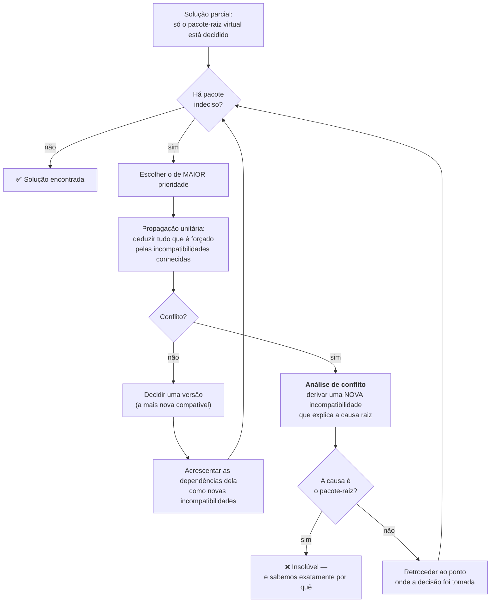

# 13 · Resolução de dependências — o coração do uv

> **Nível:** avançado · **Atualizado em:** 31/08/2026 · **uv 0.12.7**

Este é o arquivo mais denso do curso. Resolver dependências é o problema difícil de
verdade; o resto é engenharia de sistemas.

---

## 1. O problema, formalmente

Você tem:

- um conjunto de **requisitos de topo**: `{ requests>=2.31, pandas>=2 }`;
- um **universo** de pacotes, cada um com versões, cada versão com suas próprias
  dependências (que você só descobre depois de escolher a versão — as dependências fazem
  parte dos metadados da versão);
- uma **restrição de ambiente**: `python>=3.10`, e marcadores por plataforma.

Você quer: **uma atribuição de exatamente uma versão a cada pacote necessário, tal que
todas as restrições sejam satisfeitas simultaneamente** — e, entre as soluções válidas,
a que use as versões mais novas possíveis.

> **Isto é um problema NP-difícil.** É redutível a SAT (satisfatibilidade booleana): cada
> par (pacote, versão) é uma variável booleana, "exatamente uma versão por pacote" e
> "se escolhi X 1.2 então preciso de Y na faixa Z" são cláusulas. A prova para
> gerenciadores de pacote foi publicada por Mancinelli et al. em 2006, no contexto do
> Debian ("Managing the Complexity of Large Free and Open Source Package-Based Software
> Distributions"). Na prática, casos reais são resolvidos rápido porque os grafos são
> esparsos e as restrições, frouxas.

---

## 2. Como o uv resolve: PubGrub

O uv usa o **PubGrub**, através da biblioteca `pubgrub-rs`. O algoritmo foi criado por
Natalie Weizenbaum para o `pub`, o gerenciador de pacotes do Dart, e é hoje usado também
pelo Poetry, pelo Bundler do Ruby e está previsto como substituto do resolvedor do Cargo.

PubGrub é um **CDCL** (*Conflict-Driven Clause Learning*) especializado — a mesma família
dos solucionadores SAT modernos, adaptada a versões.

### O laço principal



### Os três conceitos do PubGrub

**1. Termo.** Uma afirmação sobre um pacote: `foo ∈ [1.0, 2.0)` (positivo) ou
`foo ∉ [1.5, 1.6)` (negativo).

**2. Incompatibilidade.** Um conjunto de termos que **não podem ser todos verdadeiros ao
mesmo tempo**. Toda dependência vira uma:

> "`requests 2.34.2` depende de `urllib3>=2,<3`" torna-se a incompatibilidade
> `{ requests ∈ [2.34.2, 2.34.3), urllib3 ∉ [2, 3) }` — "não pode ter essa versão de
> requests **e** um urllib3 fora dessa faixa".

**3. Solução parcial.** A pilha de decisões (escolhas) e derivações (deduções forçadas)
feitas até agora, cada uma com o nível em que entrou.

### Por que isso é melhor que backtracking ingênuo

O `pip` (desde 2020) faz *backtracking* clássico: tenta uma versão, se dá errado tenta a
anterior, e assim por diante. Se um conflito profundo é causado por uma decisão tomada 20
níveis acima, ele pode tentar milhares de combinações irrelevantes antes de voltar até lá.

O PubGrub, ao encontrar o conflito, faz **análise de conflito**: deriva uma incompatibilidade
nova que resume a causa raiz e a **memoriza**. Ao retroceder, ele pula direto para o nível
relevante e nunca mais tenta nada que viole aquela incompatibilidade aprendida. É a mesma
ideia de "aprender cláusulas" que fez os solucionadores SAT ficarem viáveis nos anos 2000.

**O segundo benefício, que é o que você percebe no dia a dia:** a cadeia de
incompatibilidades derivadas **é** a explicação do erro. Por isso as mensagens do uv são
legíveis. Saída real desta máquina:

```
  × No solution found when resolving dependencies:
  ╰─▶ Because only httpx<=1.0.dev6 is available and your project depends on
      httpx>=2.34.2, we can conclude that your project's requirements are
      unsatisfiable.
```

Compare com o `pip`, que costuma listar dezenas de candidatos tentados e terminar com
"ResolutionImpossible" sem dizer qual par causou o problema.

### Ordem de prioridade das decisões

O uv escolhe qual pacote decidir primeiro assim (do mais para o menos prioritário):

1. pacotes com **URL** fixa (`git+`, arquivo local, URL direta) — não há escolha a fazer;
2. especificadores **exatos** (`==`) — idem;
3. especificadores mais restritivos;
4. o resto.

**Por quê?** Decidir primeiro o que tem menos liberdade poda a árvore de busca mais cedo.
É a heurística *most-constrained-variable*, padrão em satisfação de restrições.

---

## 3. Resolução universal e *forking*

Aqui está a contribuição própria do uv sobre o PubGrub clássico.

### O problema

Você declara `requires-python = ">=3.9"` e depende de `numpy`. Mas:

- `numpy 2.3` exige Python ≥ 3.11;
- `numpy 2.0` funciona em 3.9.

Um resolvedor tradicional teria de escolher **uma** versão para todos: `numpy 2.0`,
punindo quem usa 3.13 com uma versão velha. Ou falhar.

### A solução: forking

O uv **divide o espaço de ambientes** e resolve cada região separadamente, gravando as
duas soluções no mesmo lock com marcadores:

```toml
[[package]]
name = "numpy"
version = "2.0.2"
[package.dependencies]  # aplicável quando python_full_version < '3.11'

[[package]]
name = "numpy"
version = "2.3.1"
[package.dependencies]  # aplicável quando python_full_version >= '3.11'
```

Na instalação, o uv avalia os marcadores para **esta** máquina e pega a linha certa.

### Controlar o forking

```bash
uv lock --fork-strategy requires-python   # padrão: versões mais novas por versão de Python
uv lock --fork-strategy fewest            # menos versões distintas no total
```

| Estratégia | Otimiza | Use quando |
|---|---|---|
| `requires-python` (padrão) | a versão mais nova possível **para cada** versão de Python | desenvolvimento normal |
| `fewest` | o menor número de versões distintas no lock | quer o lock enxuto, ou auditoria mais simples |

### Restringir o espaço — a otimização mais eficaz

Se você **sabe** que só roda em Linux e macOS, diga:

```toml
[tool.uv]
environments = [
  "sys_platform == 'linux'",
  "sys_platform == 'darwin'",
]
```

Isso reduz o espaço de resolução, deixa o lock menor, a resolução mais rápida e **evita
falhas por causa de uma plataforma que você nem usa** (o caso clássico: um pacote sem
wheel para Windows fazendo o lock inteiro falhar).

E se você **exige** que exista wheel para uma plataforma:

```toml
[tool.uv]
required-environments = ["sys_platform == 'darwin' and platform_machine == 'arm64'"]
```
Agora a resolução **falha** se algum pacote não tiver wheel para Mac ARM — em vez de você
descobrir isso no `docker build` de sexta à noite.

---

## 4. Estratégias de resolução

```bash
uv lock                                # padrão: as versões mais novas compatíveis
uv lock --resolution lowest            # as MENORES versões possíveis, diretas e transitivas
uv lock --resolution lowest-direct     # menores nas diretas, mais novas nas transitivas
```

| Estratégia | Serve para |
|---|---|
| padrão (*highest*) | desenvolvimento e produção |
| `lowest-direct` | **testar se seus limites inferiores são honestos** — o uso que realmente importa |
| `lowest` | pesquisa e reprodução histórica; na prática costuma falhar, porque força versões de 2015 de dependências transitivas |

> **Prática que eu recomendo:** rode `lowest-direct` no CI, numa coluna da matriz. É o
> único jeito de descobrir que o `>=2.0` que você escreveu há dois anos não funciona mais
> com a 2.0 de verdade. Ver o exemplo 9 em [06-exemplos](06-exemplos.md).

### Pré-lançamentos

```bash
uv lock --prerelease if-necessary   # padrão: só se não houver estável que sirva
uv lock --prerelease allow          # considera todos
uv lock --prerelease disallow       # nunca
uv lock --prerelease explicit       # só onde VOCÊ pediu explicitamente uma pré-versão
```

```toml
[tool.uv]
prerelease = "disallow"
prerelease-package = { minha-lib = "allow" }
```

---

## 5. As ferramentas de escape: constraints, overrides e exclusions

Quando a resolução não coopera, na ordem em que você deve tentar:

### 5.1 Constraints — limitar sem adicionar

```toml
[tool.uv]
constraint-dependencies = ["urllib3>=2.0"]
```
"Se `urllib3` entrar no grafo por qualquer caminho, que seja ≥ 2.0." Não adiciona o
pacote; só restringe caso ele apareça. **É a ferramenta mais segura.**

### 5.2 Overrides — mentir sobre o que um pacote pediu

```toml
[tool.uv]
override-dependencies = ["numpy>=1.26"]
```
Substitui a declaração de dependência de *qualquer* pacote. Se `pacote-velho` diz
`numpy<1.20`, o override manda o resolvedor ignorar isso.

Versão dirigida (só sobrepõe dentro de um pacote específico):
```toml
override-dependencies = [
  { package = { name = "pacote-velho", version = "0.5" }, dependencies = ["numpy>=1.26"] },
]
```

> ⚠️ **Override é uma promessa sua de que o autor estava errado.** Se ele estava certo,
> você troca um erro de resolução (rápido, na hora) por um erro em produção (lento,
> às 3 da manhã). Use quando você **verificou** que a incompatibilidade declarada é
> conservadora demais — situação, aliás, comum: muitos autores põem limites superiores
> por precaução, sem testar.

### 5.3 Exclusions — arrancar do grafo

```toml
[tool.uv]
exclude-dependencies = ["pacote-abandonado"]
```
Remove o pacote do grafo inteiro. Use quando uma dependência é opcional de fato e você
sabe que o código dela nunca é executado no seu caminho.

### 5.4 Conflitos declarados

```toml
[tool.uv]
conflicts = [[{ extra = "cpu" }, { extra = "gpu" }]]
```
"Estes dois extras nunca coexistem." Sem isso, o uv tenta resolver o caso em que os dois
estão ativos ao mesmo tempo — e falha, porque ambos trazem versões incompatíveis do
mesmo pacote. **Este é o remédio para o erro clássico do PyTorch CPU/GPU.**

### 5.5 Metadados estáticos para pacotes que não constroem

```toml
[[tool.uv.dependency-metadata]]
name = "chumpy"
version = "0.70"
requires-dist = ["numpy>=1.8.1", "scipy>=0.13.0", "six>=1.11.0"]
```
Alguns pacotes antigos só revelam suas dependências executando `setup.py` — que falha em
Python moderno. Aqui você informa os metadados diretamente e o uv não tenta construir.

---

## 6. Depurar uma resolução que falhou

**Passo 1 — leia a mensagem inteira.** O uv diz qual par de restrições conflita. Isso
resolve 70% dos casos.

**Passo 2 — veja o grafo:**
```bash
uv tree --invert --package PACOTE_PROBLEMÁTICO
```
Mostra quem exige aquele pacote. Frequentemente o culpado é uma dependência transitiva de
terceiro nível que você não sabia que existia.

**Passo 3 — veja a resolução acontecendo:**
```bash
uv lock -vv 2>&1 | tee /tmp/resolucao.log
```
Mostra cada candidato considerado e por que foi rejeitado.

**Passo 4 — reduza o espaço.** Se o erro é sobre uma plataforma que você não usa,
restrinja com `[tool.uv] environments`.

**Passo 5 — teste a hipótese isoladamente:**
```bash
uv pip compile - <<'EOF'
pacote-a>=2
pacote-b>=3
EOF
```
Isola o conflito fora do seu projeto.

### Tabela de sintomas

| Mensagem | Causa | Correção |
|---|---|---|
| `Because only X<=1.0 is available and you require X>=2.0` | versão não existe (ou nome errado) | conferir o nome no PyPI; `uv add X` sem versão |
| `... depends on Y>=2 and ... depends on Y<2` | conflito genuíno entre dois pacotes | `override-dependencies` após verificar, ou trocar um dos dois |
| `no wheels are available for X on platform Y` | falta wheel para sua plataforma | restringir `environments`, compilar do fonte, ou trocar de pacote |
| `requires Python>=3.12, but your requires-python is >=3.9` | seu `requires-python` é largo demais | subir o `requires-python` do projeto |
| resolução demora minutos | espaço grande demais, ou muitos sdists a construir | `environments` para restringir; `--fork-strategy fewest` |
| `Distribution not found` | cache corrompido ou pacote retirado do índice | `uv cache clean` |

---

## 7. Reprodutibilidade no tempo — `--exclude-newer`

```bash
uv lock --exclude-newer 2026-01-15T00:00:00Z
```
Ignora tudo publicado depois dessa data. Funciona porque o lock e os metadados do índice
guardam `upload-time`.

```toml
[tool.uv]
exclude-newer = "14 days"                        # janela deslizante
exclude-newer-package = { certifi = "0 days" }   # exceção para segurança
```

Três usos legítimos:

1. **Depuração histórica** — "reproduza a resolução de antes do deploy que quebrou".
2. **Cooldown de segurança** — não adotar pacote publicado nos últimos N dias. A maioria
   dos ataques de pacote malicioso é detectada em dias; um cooldown de 14 dias te tira
   da janela de exposição a quase custo zero.
3. **Pesquisa reprodutível** — um artigo publicado com `exclude-newer` fixo pode ser
   reproduzido anos depois com o mesmo ambiente.

---

## 8. Os cinco porquês: por que resolver é difícil?

**1. Por que não basta pegar a versão mais nova de cada pacote?**
Porque as dependências transitivas entram em conflito: A quer `C>=2`, B quer `C<2`.

**2. Por que não instalar as duas versões de C, como o npm faz?**
Porque o `sys.path` do Python associa **um nome de módulo a um objeto de módulo por
processo**. Duas `C` no mesmo processo colidiriam no `sys.modules`. O Node consegue
porque cada `require` resolve por caminho de diretório e cada módulo tem sua própria
tabela.
**Parada legítima: é uma consequência direta do modelo de import do Python, de 1991.**

**3. Por que o resolvedor não descobre tudo de uma vez e resolve?**
Porque o grafo **não é conhecido de antemão**: para saber as dependências de `pandas 2.3`
é preciso primeiro obter os metadados daquela versão específica. O grafo se revela
enquanto você o percorre. É busca com informação incompleta.

**4. Por que isso não explode combinatoriamente na prática?**
Porque os grafos reais são esparsos (a maioria dos pacotes tem menos de 5 dependências
diretas) e as restrições são frouxas (`>=` sem limite superior é o padrão cultural do
Python). O caso patológico existe, mas é raro — e quando aparece, aparece com força.

**5. Por que o Python tem essa cultura de não pôr limite superior?**
**Decisão cultural documentada:** desde 2021 a orientação da comunidade (o artigo
influente de Henry Schreiner, *"Should You Use Upper Bound Version Constraints?"*, e a
posição do próprio Poetry depois de muita crítica) é que limites superiores especulativos
(`<2.0` "por precaução") causam mais conflitos insolúveis do que previnem bugs. É por
isso que a resolução Python é mais fácil do que a de ecossistemas com travas rígidas —
e mais arriscada quando uma dependência realmente quebra compatibilidade.

---

## Autoteste

1. Por que a resolução de dependências é NP-difícil? Que problema clássico ela reduz?
2. O que é uma "incompatibilidade" no PubGrub? Traduza uma dependência simples para uma.
3. Qual é a vantagem prática da análise de conflito do PubGrub sobre o backtracking do pip?
4. Explique o *forking* com um exemplo em que ele é indispensável.
5. Qual a diferença entre `environments` e `required-environments`?
6. Quando usar `constraint-dependencies` em vez de `override-dependencies`?
7. Por que `--resolution lowest` costuma falhar e `lowest-direct` não?
8. Escreva a configuração que impede o uv de tentar resolver extras `cpu` e `gpu` juntos.
9. Cite dois usos de `--exclude-newer` que não sejam depuração.
10. Por que o Python não pode instalar duas versões do mesmo pacote como o npm faz?

---

**Fontes:**
[docs.astral.sh/uv/concepts/resolution](https://docs.astral.sh/uv/concepts/resolution/) ·
[docs.astral.sh/uv/reference/internals/resolver](https://docs.astral.sh/uv/reference/internals/resolver/) ·
[github.com/pubgrub-rs/pubgrub](https://github.com/pubgrub-rs/pubgrub) ·
[a descrição original do PubGrub por Natalie Weizenbaum](https://github.com/dart-lang/pub/blob/master/doc/solver.md) ·
Mancinelli et al., *"Managing the Complexity of Large Free and Open Source Package-Based
Software Distributions"* (ASE 2006) · mensagens de erro reproduzidas localmente com uv
0.12.7 em 31/08/2026.

**Próximo:** [14-cache-e-instalacao.md](14-cache-e-instalacao.md)
