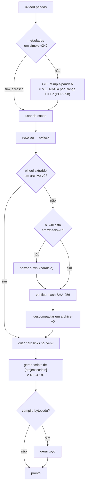

# 14 · Cache e instalação — por onde os bytes passam

> **Nível:** avançado · **Atualizado em:** 31/08/2026 · **uv 0.12.7**

Resolver diz **o quê** instalar. Este arquivo é sobre **como** os arquivos chegam ao
`.venv` — e é aqui que mora a maior parte da velocidade do uv.

---

## 1. A anatomia do cache

Conteúdo real de `~/.cache/uv` nesta máquina (31/08/2026), com os tamanhos:

```
~/.cache/uv/
├── CACHEDIR.TAG          4K    marcador padrão: diz a ferramentas de backup para pular
├── archive-v0/         296M    ⭐ WHEELS JÁ DESCOMPACTADOS — a origem dos hard links
├── binaries-v0/         53M    binários gerenciados (ruff, ty baixados por uv format/check)
├── simple-v24/          13M    respostas da Simple API dos índices (metadados)
├── environments-v2/    3,1M    ambientes efêmeros de `uv run script.py` e `uvx`
├── wheels-v6/          540K    wheels baixados, ainda em .whl
├── sdists-v9/          144K    sdists baixados e seus metadados extraídos
├── interpreter-v4/      68K    consultas a interpretadores (evita rodar python só para perguntar)
└── builds-v0/          4,0K    ambientes de build isolados (PEP 517)
```

O sufixo `-vN` é a **versão do formato daquele bucket**. Quando o uv muda o layout
interno de um bucket, ele incrementa o número e passa a usar um diretório novo — o antigo
fica órfão até um `uv cache prune`. Isso permite atualizar o uv sem invalidar o cache
inteiro.

> **Repare na proporção:** `archive-v0` é **90% do cache**. Não é onde ficam os downloads —
> é onde ficam os arquivos **já extraídos**, prontos para serem ligados ao `.venv`. Essa
> escolha de projeto é o que torna a instalação quase instantânea.

---

## 2. Hard links: a instalação sem copiar bytes

### O que é um hard link

Num sistema de arquivos POSIX, um arquivo é um **inode** (os dados) mais uma ou mais
**entradas de diretório** (os nomes) que apontam para ele. Um *hard link* é simplesmente
mais um nome para o mesmo inode. Custa alguns bytes de metadado; **não** duplica o conteúdo.

### Provando que o uv faz isso

Comando executado nesta máquina, no `.venv` do projeto-modelo:

```bash
ls -li .venv/lib/python3.10/site-packages/rich/__init__.py
```
```
11303940 -rw-rw-r-- 4 ronivaldo ronivaldo 6131 ago 31 16:36 .venv/.../rich/__init__.py
   ↑                ↑
 inode        contagem de links = 4
```

A contagem `4` significa: existem **quatro** nomes apontando para este mesmo inode — o do
cache e os de três `.venv` diferentes que instalaram a mesma versão do `rich`. Os bytes
existem **uma vez só** no disco.

### O que isso significa na prática

| Consequência | Detalhe |
|---|---|
| Criar um `.venv` com 200 pacotes leva milissegundos | não há cópia de bytes, só criação de entradas de diretório |
| Ter 30 projetos com `pandas` custa o espaço de **um** `pandas` | não trinta |
| Apagar um `.venv` é seguro e barato | o inode só some quando a última referência sumir |
| **Editar um arquivo dentro do `.venv` corrompe o cache** | ⚠️ você estaria editando o inode compartilhado — a mudança aparece em todos os projetos e no cache |

> **A armadilha do hard link, e ela é real:** aquele hábito de "vou só colocar um `print`
> dentro da biblioteca para depurar" **contamina todos os seus projetos e o cache**. Se
> você precisa mesmo mexer, use `uv pip install -e /caminho/do/fonte` ou
> `UV_LINK_MODE=copy`.

---

## 3. Os quatro modos de ligação

```bash
uv sync --link-mode hardlink   # padrão
uv sync --link-mode copy
uv sync --link-mode symlink
uv sync --link-mode clone
```
Ou `UV_LINK_MODE=copy` / `[tool.uv] link-mode = "copy"`.

| Modo | Como funciona | Velocidade | Espaço | Quando usar |
|---|---|---|---|---|
| **hardlink** | outro nome para o mesmo inode | ⚡ máxima | mínimo | padrão; exige mesmo sistema de arquivos |
| **clone** (*reflink*) | cópia com *copy-on-write* do sistema de arquivos | ⚡ quase igual | mínimo até você escrever | APFS (macOS), Btrfs, XFS com reflink, ZFS |
| **copy** | cópia real dos bytes | 🐢 lenta | máximo | volumes diferentes (Docker, WSL/`mnt`, NFS) |
| **symlink** | link simbólico | ⚡ rápida | mínimo | raro; quebra se o cache for apagado, e confunde ferramentas |

**`clone` é o melhor dos dois mundos** onde existe: espaço compartilhado como o hardlink,
mas escrever no arquivo **não** afeta as outras cópias, porque o sistema de arquivos faz
a separação sozinho. No macOS moderno (APFS) o uv já usa clone por padrão.

### O erro que você vai encontrar

```
error: failed to create hardlink ... Invalid cross-device link
```

Causa: o cache e o `.venv` estão em **sistemas de arquivos diferentes**. Hard links não
atravessam dispositivos — é uma limitação do kernel, não do uv.

Ocorre tipicamente em:
- **Docker**, com o cache num volume montado e o `.venv` na camada da imagem;
- **WSL2**, com o cache em `/home` e o projeto em `/mnt/c`;
- **NFS / disco de rede**;
- **CI** com cache restaurado em outro ponto de montagem.

Correção, em ordem:
1. `export UV_LINK_MODE=copy` (sempre funciona, custa desempenho);
2. mover o cache para o mesmo volume: `export UV_CACHE_DIR=/app/.uv-cache`;
3. no WSL, mover o projeto para `/home` (a correção certa).

---

## 4. O caminho completo de um pacote



### E se só houver sdist?

Aí o caminho é bem mais caro:

```
baixar sdist → criar ambiente de build isolado (builds-v0) →
instalar o build backend declarado em [build-system] →
executar o backend para produzir um wheel → guardar em archive-v0 → ligar
```

É por isso que o `resumo` do projeto-modelo deste curso **destaca em vermelho** os
pacotes sem wheel: eles são o gargalo, e são a causa de "o build quebrou no servidor mas
funciona na minha máquina" (o servidor não tem compilador).

Para proibir builds e falhar cedo:
```bash
uv sync --no-build          # nenhum sdist pode ser construído
uv sync --only-binary :all: # equivalente, sintaxe do pip
```

---

## 5. Metadados sem baixar o pacote (PEP 658)

Este é um dos truques mais elegantes do uv, e explica boa parte da vantagem sem cache.

**O problema:** para saber de que `pandas 2.3.3` depende, historicamente era preciso
baixar o wheel inteiro (60 MB) e ler o `METADATA` de dentro do ZIP. Multiplicado por
dezenas de candidatos durante o backtracking, dá centenas de megabytes de tráfego para
descobrir metadados de poucos kilobytes.

**As duas soluções, e o uv usa as duas:**

1. **PEP 658** — o índice serve o arquivo `METADATA` separadamente. Uma requisição, alguns
   kilobytes. O PyPI oferece isso desde 2023. É o caminho preferido.
2. **`Range` de HTTP** — quando o índice não oferece o PEP 658, o uv usa requisições
   `Range` para ler apenas o *diretório central* do ZIP (que fica no fim do arquivo) e
   depois só os bytes do `METADATA`. Baixa poucos kilobytes de um arquivo de 60 MB.

O segundo truque exige que o servidor aceite `Range`, o que o `files.pythonhosted.org`
aceita. Alguns proxies corporativos **não** aceitam — e é por isso que o uv às vezes fica
notavelmente mais lento atrás de um proxy mal configurado.

---

## 6. Gerenciar o cache

```bash
uv cache dir      # onde fica
uv cache size     # quanto ocupa (preview) — 217247744 bytes ≈ 207 MiB aqui
uv cache prune    # remove entradas não alcançáveis. SEGURO
uv cache prune --ci   # remove também wheels construídos localmente, mantém os baixados
uv cache clean    # apaga tudo
uv cache clean pandas # apaga só as entradas de um pacote
```

| Comando | Remove | Use quando |
|---|---|---|
| `prune` | buckets de versão antiga, sdists já convertidos em wheel, entradas órfãs | manutenção de rotina; disco apertado |
| `prune --ci` | idem + wheels que foram construídos na máquina (caros de guardar, baratos de refazer... na verdade o contrário: o objetivo é encolher o cache que o CI vai *subir*) | ao final de um job de CI que persiste o cache |
| `clean` | tudo | quando você suspeita de corrupção |

**Onde colocar o cache:**

```bash
export UV_CACHE_DIR=/mnt/dados/uv-cache    # disco grande
export UV_CACHE_DIR=/app/.uv-cache          # dentro do volume do Docker
```
Regra: **mesmo sistema de arquivos que os seus `.venv`**, para os hard links funcionarem.

**Trabalhar sem rede:**
```bash
export UV_OFFLINE=1
uv sync            # usa só o que está em cache; falha claramente se faltar algo
```

---

## 7. Bytecode: `.pyc` e o tempo de inicialização

Por padrão o uv **não** gera `.pyc` na instalação — o Python os gera na primeira
importação. Isso deixa a instalação mais rápida, ao custo de a **primeira execução** ser
mais lenta.

Em container isso é ruim: a "primeira execução" acontece a cada novo pod, e o diretório
pode ser somente-leitura (então nunca é cacheado).

```bash
UV_COMPILE_BYTECODE=1 uv sync
```
ou
```toml
[tool.uv]
compile-bytecode = true
```

| Contexto | Recomendação |
|---|---|
| Desenvolvimento local | deixe desligado (padrão) |
| Imagem Docker de produção | **ligue** — pagamos uma vez no build, ganhamos em todo start |
| Função serverless (Lambda, Cloud Run) | **ligue** — o cold start é o que você está otimizando |
| Sistema de arquivos somente-leitura | **ligue**, senão nunca haverá `.pyc` |

---

## 8. Medindo, em vez de acreditar

Medição real desta máquina em 31/08/2026 (Ubuntu 22.04.5, NVMe, `fastapi` + `pandas`):

| Cenário | Tempo |
|---|---|
| `python -m venv` + `pip install` | **23,5 s** |
| `uv venv` + `uv pip install --no-cache` | **3,6 s** |
| `uv venv` + `uv pip install` (cache quente) | **3,0 s** |

Como reproduzir na sua máquina:

```bash
PKGS="fastapi==0.121.2 pandas==2.3.3"

rm -rf /tmp/bpip && python3 -m venv /tmp/bpip
time /tmp/bpip/bin/pip install -q $PKGS

rm -rf /tmp/buv && uv venv -q /tmp/buv
time env VIRTUAL_ENV=/tmp/buv uv pip install -q --no-cache $PKGS

rm -rf /tmp/buv2 && uv venv -q /tmp/buv2
time env VIRTUAL_ENV=/tmp/buv2 uv pip install -q $PKGS
```

> **Honestidade sobre a medição:** meu teste foi dominado por rede. A diferença entre
> cold e warm ficou pequena (3,6 s → 3,0 s) porque o download foi rápido. Em máquinas com
> internet lenta, ou ao recriar ambientes já conhecidos, a diferença fica muito maior —
> é aí que nascem os números de "80–115×" do anúncio original da Astral. Meça o seu caso.

---

## 9. Os cinco porquês: por que instalar um pacote Python era lento?

**1. Por que o `pip` demora tanto?**
Porque ele baixa, descompacta e copia arquivo por arquivo, quase tudo sequencialmente.

**2. Por que sequencialmente?**
Porque o `pip` é escrito em Python e o modelo de execução dele é síncrono. Paralelizar
I/O em Python exige `asyncio` ou threads, e reescrever o `pip` para isso significaria
mexer numa base de código de 15 anos com compatibilidade sagrada.

**3. Por que ele copia os arquivos em vez de ligar?**
**Decisão histórica:** quando o `pip` foi escrito (2008), não havia um cache global de
wheels extraídos — o conceito de wheel nem existia (2012). O cache do `pip` guarda os
`.whl`, não o conteúdo extraído; então instalar sempre implica descompactar de novo.

**4. Por que o `pip` não adotou o cache de arquivos extraídos depois?**
**Trade-off explícito:** mudaria o comportamento observável (arquivos compartilhados
entre ambientes, com a armadilha de edição descrita na seção 2) e traria risco de
regressão para milhões de usuários. Para uma ferramenta mantida por voluntários com
compromisso de estabilidade, o cálculo risco/benefício não fecha.

**5. Por que o uv pôde fazer diferente?**
Porque começou do zero, em 2024, com wheels já universais, e sem compromisso de
compatibilidade com o comportamento interno de ninguém — só com a **interface**. É o
mesmo padrão da história inteira do uv: compatível por fora, livre por dentro.

---

## Autoteste

1. O que é `archive-v0` e por que ele é 90% do cache?
2. Explique um hard link em termos de inode e entrada de diretório.
3. Como provar, com um comando, que o uv usou hard links?
4. Por que editar um arquivo dentro do `.venv` é perigoso com `link-mode = hardlink`?
5. Quais são os quatro modos de ligação e quando usar cada um?
6. O que causa `Invalid cross-device link` e quais as três correções, em ordem?
7. Descreva os dois mecanismos que permitem obter metadados sem baixar o wheel inteiro.
8. Quando `UV_COMPILE_BYTECODE=1` compensa? Cite três contextos.
9. Qual a diferença entre `uv cache prune` e `uv cache clean`?
10. Por que o `pip` não pode simplesmente adotar o esquema de cache do uv?

---

**Fontes:** inspeção direta de `~/.cache/uv` e medições executadas em 31/08/2026 (uv
0.12.7, Ubuntu 22.04.5) · [docs.astral.sh/uv/concepts/cache](https://docs.astral.sh/uv/concepts/cache/) ·
[PEP 658](https://peps.python.org/pep-0658/) · [PEP 427](https://peps.python.org/pep-0427/).

**Próximo:** [15-gerenciamento-de-python.md](15-gerenciamento-de-python.md)
