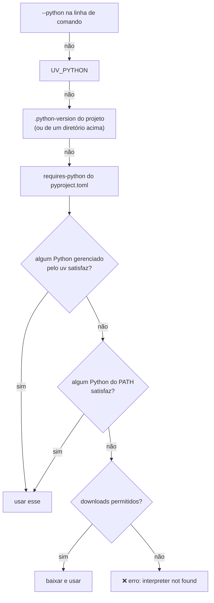

# 15 · Gerenciamento de Python — o uv como substituto do pyenv

> **Nível:** intermediário → avançado · **Atualizado em:** 31/08/2026 · **uv 0.12.7**

O recurso mais surpreendente do uv: ele instala o próprio Python. Este arquivo explica
como, de onde vêm esses interpretadores, e o que eles têm de diferente.

---

## 1. Por que o uv **pode** fazer isso

O uv é um binário estático em Rust. Não depende de Python para funcionar. Consequência:
ele pode ser a primeira coisa que você instala numa máquina limpa, e a partir dele
resolver o resto — inclusive o interpretador.

Compare com o `pyenv`: é um conjunto de scripts de shell que **compila o CPython do
código-fonte** na sua máquina. Isso exige `gcc`, `make`, `libssl-dev`, `zlib1g-dev`,
`libbz2-dev`, `libsqlite3-dev`, `libffi-dev`, `libreadline-dev`... e leva de 2 a 10
minutos por versão. Metade dos problemas com pyenv é uma dessas bibliotecas faltando —
e o sintoma costuma ser silencioso: o Python compila, mas sem `ssl` ou sem `sqlite3`.

O uv **baixa um binário pronto**: 30–35 MB, 5 a 15 segundos, nenhuma dependência de
sistema.

---

## 2. De onde vêm esses Pythons

Do projeto [`astral-sh/python-build-standalone`](https://github.com/astral-sh/python-build-standalone),
originalmente criado por Gregory Szorc e depois adotado e mantido pela Astral.

São builds **oficiais do CPython** (mesmo código-fonte, mesmas tags de release),
compilados de forma:

- **relocável** — funcionam em qualquer caminho, sem `configure --prefix` fixo;
- **com ligação estática** sempre que possível — OpenSSL, libffi, SQLite, zlib, bzip2,
  lzma, ncurses vão dentro do pacote;
- **portátil** — um build por (plataforma, arquitetura, libc), que funciona em
  distribuições diferentes.

### O que exatamente muda em relação a um Python "do sistema"

Isto é importante e a maioria dos tutoriais omite:

| Aspecto | Python do sistema (apt/dnf/brew) | Python do uv |
|---|---|---|
| `sys.prefix` | fixo em `/usr` ou `/opt/homebrew` | relocável |
| `libpython` compartilhada (`libpython3.13.so`) | normalmente presente | **pode não estar** — build estático |
| Bibliotecas de sistema | dinâmicas (`libssl.so` da distro) | estáticas, versão fixada no build |
| Atualização de segurança do OpenSSL | via `apt upgrade` do SO | só quando um novo build do Python sair |
| `tkinter` (interface gráfica) | via pacote `python3-tk` | **incluído em builds recentes**, mas historicamente foi um ponto fraco |
| Extensões C que embutem Python (`libpython`) | funcionam | **podem falhar** — este é o caso real de incompatibilidade |
| Integração com o gerenciador do SO | total | nenhuma (e isso é uma vantagem) |

**Quando isso te morde de verdade** — três casos observados na prática:

1. Software que **embute** o interpretador e precisa ligar contra `libpython` compartilhada
   (alguns plugins do Blender, do GDB, do Vim, mod_wsgi do Apache).
2. Ambientes com política de conformidade que exige que **o OpenSSL venha do SO**, para
   receber os patches de segurança da distro.
3. Builds `manylinux` muito antigos que assumem uma `libpython` dinâmica.

Em qualquer desses, use o Python do sistema:

```bash
uv python pin /usr/bin/python3.12
```
ou
```bash
export UV_PYTHON_DOWNLOADS=never
```

> **Opinião profissional:** para 95% do trabalho — aplicações web, dados, automação,
> bibliotecas puras — o Python do uv é indistinguível do da distro e muito mais prático.
> A distinção importa em integração com software C que embute o interpretador. Se você
> não sabe se está nesse caso, não está.

---

## 3. Os comandos

```bash
uv python list                  # instalados + disponíveis para download
uv python list --only-installed
uv python list --all-versions   # todos os patches, não só o mais novo de cada minor
uv python install 3.13
uv python install 3.11 3.12 3.13 3.14   # várias de uma vez
uv python install --reinstall 3.13      # reinstalar (build corrompido)
uv python upgrade 3.13          # atualizar o patch dentro do minor
uv python pin 3.13              # escreve .python-version
uv python pin --resolved 3.13   # grava a versão exata resolvida (3.13.15)
uv python find 3.12             # imprime o caminho do interpretador
uv python dir                   # onde as instalações ficam
uv python uninstall 3.11
uv python uninstall --all
uv python update-shell          # expõe python3.13 no PATH
```

Saída real de `uv python list` nesta máquina (recortada):

```
cpython-3.15.0rc1-linux-x86_64-gnu                 <download available>
cpython-3.15.0rc1+freethreaded-linux-x86_64-gnu    <download available>
cpython-3.14.7-linux-x86_64-gnu                    <download available>
cpython-3.14.7+freethreaded-linux-x86_64-gnu       <download available>
cpython-3.13.15-linux-x86_64-gnu                   <download available>
cpython-3.12.14-linux-x86_64-gnu                   <download available>
cpython-3.11.16-linux-x86_64-gnu                   <download available>
cpython-3.10.12-linux-x86_64-gnu                   /usr/bin/python3.10
cpython-3.10.12-linux-x86_64-gnu                   /usr/bin/python3 -> python3.10
cpython-3.9.25-linux-x86_64-gnu                    <download available>
cpython-3.8.20-linux-x86_64-gnu                    <download available>
pypy-3.11.15-linux-x86_64-gnu                      <download available>
pypy-3.10.16-linux-x86_64-gnu                      <download available>
graalpy-3.12.0-linux-x86_64-gnu                    <download available>
graalpy-3.8.5-linux-x86_64-gnu                     <download available>
```

Três coisas para notar:

1. O uv **enxerga e reaproveita** o Python do sistema (`/usr/bin/python3.10`), com o
   *symlink* `python3` documentado. Ele não duplica o que já existe.
2. Oferece **PyPy** e **GraalPy**, não só CPython.
3. Oferece builds **`+freethreaded`** — o CPython sem GIL da PEP 703.

---

## 4. Como escrever "qual Python eu quero"

Todas estas formas são válidas em `--python`, `UV_PYTHON`, `.python-version` e
`uv python install`:

| Forma | Significa |
|---|---|
| `3.13` | o patch mais novo disponível da série 3.13 |
| `3.13.2` | exatamente essa |
| `>=3.11,<3.14` | faixa (PEP 440) |
| `cpython@3.13` | implementação explícita |
| `pypy@3.11` | PyPy |
| `graalpy@3.12` | GraalPy |
| `3.14t` ou `3.14+freethreaded` | build sem GIL |
| `cpython-3.13.2-linux-x86_64-gnu` | a chave completa, sem ambiguidade |
| `/usr/bin/python3.12` | caminho absoluto de um interpretador específico |
| `python3.12` | nome de executável a ser procurado no `PATH` |

---

## 5. A ordem de descoberta, exata

Quando você roda `uv run`, `uv sync` ou `uv venv`, a busca é esta:



Modificadores:

```bash
uv run --managed-python ...     # exigir Python gerenciado pelo uv, ignorar o do sistema
uv run --no-managed-python ...  # o contrário: só interpretadores do sistema
export UV_PYTHON_DOWNLOADS=never  # nunca baixar (ambiente controlado, ar-gapped)
```

> **Comportamento que confunde:** `uv venv` **fora** de um projeto não lê
> `.python-version` de lugar nenhum, e escolhe o Python **preferido do uv** — que pode
> ser um gerenciado recém-baixado, não o do sistema. Foi o que aconteceu nos testes
> deste curso: `uv venv v1` criou o ambiente com CPython 3.14.7, e não com o 3.10.12 do
> Ubuntu. Se você quer determinismo, passe `-p`/`--python` sempre.

---

## 6. `.python-version` — o arquivo de uma linha que resolve muita coisa

```bash
uv python pin 3.13
cat .python-version
# 3.13
```

- É lido pelo uv **e** pelo pyenv — o formato é compatível, o que ajuda em equipes mistas.
- Deve ser **versionado no Git**.
- Se a versão não estiver instalada, o uv **baixa automaticamente**. Isso é enorme: um
  colega novo clona o repositório, roda `uv run pytest` e funciona, sem instruções.

**Fixar patch ou só minor?**

| Escolha | Prós | Contras |
|---|---|---|
| `3.13` (minor) | recebe correções de segurança do patch automaticamente | duas máquinas podem ter patches diferentes |
| `3.13.15` (patch exato) | reprodutibilidade total | precisa atualizar à mão; você fica em versão vulnerável até lembrar |

**Minha recomendação:** `3.13` (minor) para desenvolvimento e bibliotecas;
patch exato apenas em imagens de produção, onde a imagem inteira já é uma versão
fixada e auditada.

---

## 7. Free-threaded (sem GIL) — o que é e se você deve usar

O **GIL** (*Global Interpreter Lock*) é o cadeado que impede dois threads Python de
executarem bytecode ao mesmo tempo. A **PEP 703** (2023) tornou possível compilar o
CPython sem ele; desde o 3.13 existem builds oficiais `freethreaded`, e no 3.14 eles
saíram do status experimental.

```bash
uv python install 3.14t
uv run --python 3.14t python -c "import sys; print(sys._is_gil_enabled())"
# esperado: False
```

| Ganha | Perde |
|---|---|
| paralelismo real de threads em CPU | desempenho single-thread ~5–10% pior (o número melhorou muito desde 2023) |
| não precisa de `multiprocessing` para usar todos os núcleos | boa parte das extensões C ainda não é compatível |
| — | ecossistema de wheels `cp314t` ainda incompleto em 2026 |

> **Recomendação em agosto de 2026:** use para **experimentar e medir**, não em produção,
> a menos que você tenha um caso de CPU-bound com threads e tenha verificado que todas as
> suas dependências binárias têm wheel `t`. O uv facilita muito o experimento — é uma
> linha de comando — e é exatamente para isso que ele serve aqui.

---

## 8. Comparação honesta com as alternativas

| | **uv** | **pyenv** | **conda/mamba** | **Docker** | **SO (apt/brew)** |
|---|---|---|---|---|---|
| Instala Python | binário pronto | **compila** | binário | imagem inteira | binário |
| Tempo por versão | ~10 s | 2–10 min | ~30 s | minutos | ~30 s |
| Dependências de sistema | nenhuma | ~8 pacotes `-dev` | nenhuma | Docker | gerenciador do SO |
| Windows | ✅ nativo | ❌ (só `pyenv-win`, projeto separado) | ✅ | ✅ | ✅ |
| Gerencia pacotes também | ✅ | ❌ | ✅ | — | parcialmente |
| Bibliotecas não-Python (CUDA, MKL, GDAL) | ❌ | ❌ | ✅ **a força do conda** | ✅ | ✅ |
| Isolamento do SO | nenhum | nenhum | nenhum | **total** | — |

**Quando eu ainda usaria conda em 2026:** projetos científicos com dependências binárias
pesadas fora do PyPI (GDAL, PROJ, algumas pilhas de CUDA, R junto com Python,
bioinformática). Fora disso, uv.

**Quando eu usaria Docker em vez do uv para o Python:** quando o isolamento tem de ser do
sistema operacional inteiro, não só do Python — e mesmo aí, **use uv dentro do container**.
Ver [19-uv-em-docker-e-ci](19-uv-em-docker-e-ci.md).

---

## 9. Os cinco porquês: por que o Python precisa ser "gerenciado"?

**1. Por que não usar o Python que veio no sistema?**
Porque ele quase sempre é de uma versão que a distribuição escolheu (Ubuntu 22.04 traz
3.10, de 2021), e projetos diferentes precisam de versões diferentes.

**2. Por que a distribuição não oferece todas as versões?**
Porque cada versão suportada é trabalho de manutenção e superfície de segurança. Uma
distro suporta uma versão de Python por release **e a integra ao próprio sistema** —
`apt`, `dnf`, `firewalld` são escritos em Python.

**3. Por que isso torna perigoso mexer no Python do sistema?**
Porque substituir ou atualizar um pacote de que o `apt` depende pode quebrar o
gerenciador de pacotes — e sem `apt` funcionando, consertar fica muito difícil.
Foi essa classe de estrago que motivou a **PEP 668** (2022), que faz o `pip` global
recusar instalação.

**4. Por que não basta compilar o Python que eu quero (pyenv)?**
Porque compilar exige um ambiente de build completo e correto, e a falha é **silenciosa**:
falta `libssl-dev` → você ganha um Python sem `ssl`, que só quebra no dia em que fizer um
`https`. Isso não é hipotético; é a queixa mais comum sobre pyenv.

**5. Por que não havia binários portáteis oficiais do CPython antes?**
**Decisão histórica documentada:** o python.org publica instaladores para macOS e Windows,
mas nunca para Linux — a posição é que **distribuir binários Linux é papel das distros**,
por causa da diversidade de libc, de bibliotecas de sistema e de política de segurança.
O `python-build-standalone` nasceu justamente para preencher essa lacuna, fora do
processo oficial, e o uv o adotou.
**Parada legítima: é uma posição de política do projeto CPython, não uma limitação técnica.**

---

## Autoteste

1. Por que o uv consegue instalar o Python e o `pip` não conseguiria?
2. Cite três diferenças reais entre o Python do uv e o Python da distro.
3. Em que três situações concretas o Python do uv pode causar problema?
4. Escreva a ordem completa de descoberta do interpretador, em sete passos.
5. Qual comportamento de `uv venv` fora de um projeto surpreende, e como evitar?
6. Fixar `3.13` ou `3.13.15` no `.python-version`? Justifique nos dois cenários.
7. O que é um build `freethreaded` e por que ainda não usá-lo em produção?
8. Quando o conda ainda é a escolha certa em 2026?
9. Por que a PEP 668 existe, e que estrago ela previne?
10. Por que o python.org nunca publicou binários Linux oficiais?

---

**Fontes:** saídas de `uv python list` e testes locais em 31/08/2026 (uv 0.12.7) ·
[github.com/astral-sh/python-build-standalone](https://github.com/astral-sh/python-build-standalone) ·
[docs.astral.sh/uv/concepts/python-versions](https://docs.astral.sh/uv/concepts/python-versions/) ·
[PEP 703](https://peps.python.org/pep-0703/) · [PEP 668](https://peps.python.org/pep-0668/).

**Próximo:** [16-ferramentas-e-scripts.md](16-ferramentas-e-scripts.md)
