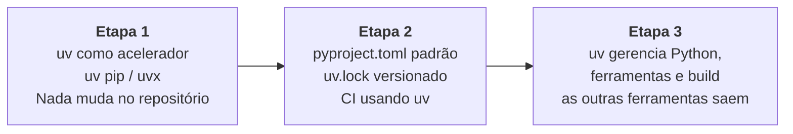

# 20 · Migração — de pip, Poetry, Pipenv, PDM e conda

> **Nível:** intermediário → avançado · **Atualizado em:** 31/08/2026 · **uv 0.12.7**

Como sair de onde você está, sem quebrar o time. E, honestamente: quando **não** migrar.

---

## 1. A regra geral da migração

**Migre em três etapas, nunca em uma.**



A etapa 1 é reversível em um `git checkout`, e já entrega a maior parte do ganho de
tempo. Comece por ela, deixe o time acostumar por duas semanas, e só então avance.

---

## 2. De `pip` + `requirements.txt`

### Etapa 1 — trocar só o executável

```bash
uv venv
source .venv/bin/activate
uv pip install -r requirements.txt
```
Um `sed s/pip install/uv pip install/` no seu CI já entrega 5–10× de velocidade, sem
mudar nenhum arquivo do repositório.

### Etapa 2 — adotar o modo projeto

```bash
uv init --bare                              # cria pyproject.toml sem tocar no resto
uv add -r requirements.txt
uv add --group dev -r requirements-dev.txt
uv run pytest                               # confirmar que tudo passa
git add pyproject.toml uv.lock && git rm requirements.txt requirements-dev.txt
```

### Se algo externo ainda exige `requirements.txt`

Gere-o **a partir do lock**, e nunca o edite:

```bash
uv export --format requirements.txt --no-dev --no-hashes -o requirements.txt
```
E automatize com o hook `uv-export` do pre-commit ([19-uv-em-docker-e-ci](19-uv-em-docker-e-ci.md)).

### De `pip-tools`

Migração quase literal:

| `pip-tools` | uv |
|---|---|
| `pip-compile requirements.in` | `uv pip compile requirements.in -o requirements.txt` |
| `pip-sync requirements.txt` | `uv pip sync requirements.txt` |
| `pip-compile --upgrade` | `uv pip compile --upgrade` |
| — | `uv pip compile --universal` (multiplataforma; o `pip-tools` não faz) |

Você pode ficar aqui para sempre e estar bem servido. Mas o modo projeto (`uv lock`)
é melhor, porque resolve para todas as plataformas de uma vez.

---

## 3. De **Poetry**

A migração mais comum, e a mais fácil — porque os dois usam `pyproject.toml`.

### O que muda

| Poetry (formato antigo) | uv / padrão PEP 621 |
|---|---|
| `[tool.poetry] name/version` | `[project] name/version` |
| `[tool.poetry.dependencies]` | `[project] dependencies = [...]` |
| `python = "^3.11"` | `requires-python = ">=3.11"` |
| `[tool.poetry.group.dev.dependencies]` | `[dependency-groups] dev = [...]` |
| `[tool.poetry.extras]` | `[project.optional-dependencies]` |
| `[tool.poetry.scripts]` | `[project.scripts]` |
| `poetry.lock` | `uv.lock` |
| `poetry-core` (build backend) | `uv_build` ou `hatchling` |

> **Nota:** o Poetry 2.0 (2025) passou a suportar `[project]` da PEP 621. Se seu projeto
> já usa esse formato, a migração é praticamente só trocar o `[build-system]`.

### O `^` do Poetry — a diferença que morde

`python = "^3.11"` no Poetry significa `>=3.11,<4.0`. Ao converter, escreva
`requires-python = ">=3.11"`. E, para as dependências, `^2.1` vira `>=2.1,<3`.

> **Opinião:** eu **não** transcrevo os `^` das dependências. O `^` é um limite superior
> especulativo, e limites superiores especulativos são a principal causa de conflitos
> insolúveis no Python. Converta para `>=` e deixe o lock fazer o trabalho de fixar.
> Ver a discussão em [13-resolucao](13-resolucao-de-dependencias.md).

### Roteiro

```bash
# 1. Guardar o estado atual, para comparar depois
poetry show --tree > /tmp/antes.txt
poetry export -f requirements.txt --without-hashes -o /tmp/antes-req.txt

# 2. Converter automaticamente (ferramenta da comunidade)
uvx migrate-to-uv

# 3. Conferir o pyproject.toml gerado, à mão
$EDITOR pyproject.toml

# 4. Resolver e instalar
uv lock
uv sync --all-groups

# 5. Comparar
uv tree > /tmp/depois.txt
diff /tmp/antes.txt /tmp/depois.txt

# 6. Testar de verdade
uv run pytest

# 7. Só então
git rm poetry.lock
git add pyproject.toml uv.lock
```

> `migrate-to-uv` é uma ferramenta **da comunidade**, não da Astral. Ela funciona bem
> para Poetry, Pipenv e pip-tools, mas **confira o resultado**. Migração automática de
> configuração é sempre 90% — os 10% são seus.

### O que você ganha e o que perde

| Ganha | Perde |
|---|---|
| 10–50× de velocidade | `poetry shell` (use `uv run`, ou `source .venv/bin/activate`) |
| gerenciamento de Python integrado | plugins do Poetry (`poetry-dynamic-versioning` etc.) |
| `uvx`/`uv tool` no lugar do pipx | a interface interativa do `poetry add --group` |
| lock universal explícito | — |
| workspaces de verdade | — |

Para versionamento dinâmico, o substituto é `hatch-vcs` — ver
[18-publicacao](18-publicacao-e-build-backend.md).

---

## 4. De **Pipenv**

```bash
uvx migrate-to-uv
# ou, à mão:
uv init --bare
uv add $(pipenv requirements | grep -v '^-' | tr '\n' ' ')
uv add --group dev $(pipenv requirements --dev-only | grep -v '^-' | tr '\n' ' ')
```

`Pipfile` e `Pipfile.lock` saem; `pyproject.toml` e `uv.lock` entram. Sem drama: o
Pipenv nunca teve recursos que o uv não tenha.

---

## 5. De **PDM**

O PDM já usa PEP 621 e PEP 735. A migração costuma ser: trocar o `[build-system]`,
converter `[tool.pdm.dev-dependencies]` para `[dependency-groups]`, rodar `uv lock`.
Apague o `pdm.lock` e o `.pdm-python`.

---

## 6. De **conda** — o caso difícil e honesto

**Aqui você deve pensar antes.** Conda e uv resolvem problemas parcialmente diferentes.

| | conda | uv |
|---|---|---|
| Pacotes Python | ✅ (canais próprios) | ✅ (PyPI) |
| Bibliotecas **não-Python** (CUDA, MKL, GDAL, PROJ, R, compiladores) | ✅ **a razão de existir** | ❌ |
| Instalação do Python | ✅ | ✅ |
| Velocidade | 🐢 (o `mamba`/`libmamba` melhorou muito) | ⚡ |
| Ecossistema | conda-forge, ~25 mil pacotes | PyPI, ~600 mil |
| Licença/custos | canais `defaults` da Anaconda **exigem licença paga** para empresas grandes desde 2024 — conda-forge é livre | totalmente livre |

### Quando migrar

Se as suas dependências **estão todas no PyPI** — o caso da maioria das aplicações web,
APIs, automação, e mesmo boa parte de ciência de dados hoje (numpy, pandas, scipy,
scikit-learn, torch e tensorflow publicam wheels excelentes no PyPI):

```bash
conda list --export > /tmp/conda-antes.txt      # registrar o estado
uv init --bare
uv add numpy pandas scikit-learn matplotlib     # o que você realmente usa
uv run python -c "import numpy, pandas; print('ok')"
```

### Quando **não** migrar

- GDAL, PROJ, GEOS (geoespacial) — a instalação via PyPI é frágil.
- Bioinformática (Bioconda: samtools, bwa, blast — são binários, não pacotes Python).
- R e Python no mesmo ambiente.
- Compiladores e toolchains gerenciados pelo ambiente.
- Pilhas CUDA muito específicas em que o conda-forge resolve versões de driver.

### O caminho híbrido (o que eu recomendo nesses casos)

Use conda para o que só o conda faz, e o uv para os pacotes Python:

```bash
conda create -n meuambiente python=3.12 gdal proj
conda activate meuambiente
uv pip install -r requirements.txt        # o uv detecta o ambiente conda ativo
```

**Regra do híbrido:** um pacote deve ser gerenciado por **um** dos dois, nunca pelos dois.
O conda não sabe o que o uv instalou, e vai sobrescrever alegremente. Escolha a fronteira
(por exemplo: "tudo que é binário de sistema vem do conda; tudo que é biblioteca Python
vem do uv") e documente-a no README.

---

## 7. Tabela de tradução de comandos

| Tarefa | pip / venv | Poetry | conda | **uv** |
|---|---|---|---|---|
| criar ambiente | `python -m venv .venv` | `poetry install` | `conda create -n x` | `uv venv` (ou implícito) |
| ativar | `source .venv/bin/activate` | `poetry shell` | `conda activate x` | **desnecessário** (`uv run`) |
| instalar dependência | `pip install X` | `poetry add X` | `conda install X` | `uv add X` |
| dependência de dev | `pip install X` | `poetry add -G dev X` | — | `uv add --dev X` |
| remover | `pip uninstall X` | `poetry remove X` | `conda remove X` | `uv remove X` |
| listar | `pip list` | `poetry show` | `conda list` | `uv pip list` / `uv tree` |
| árvore | `pipdeptree` | `poetry show --tree` | — | `uv tree` |
| travar versões | `pip freeze >` | `poetry lock` | `conda env export` | `uv lock` |
| instalar do lock | `pip install -r` | `poetry install` | `conda env create -f` | `uv sync` |
| rodar comando | `python x.py` (ativado) | `poetry run x` | `conda run x` | `uv run x` |
| atualizar tudo | manual | `poetry update` | `conda update --all` | `uv lock --upgrade` |
| trocar Python | `pyenv local 3.13` | `poetry env use 3.13` | `conda install python=3.13` | `uv python pin 3.13` |
| ferramenta global | `pipx install X` | — | — | `uv tool install X` |
| construir pacote | `python -m build` | `poetry build` | `conda build` | `uv build` |
| publicar | `twine upload` | `poetry publish` | `anaconda upload` | `uv publish` |

---

## 8. Quando **não** migrar — sendo honesto

| Situação | Recomendação |
|---|---|
| Projeto estável, sem manutenção ativa, que funciona | **não migre.** Migração é custo sem receita aqui |
| Equipe no meio de um prazo apertado | migre **depois**. É uma mudança de fluxo de trabalho, não uma correção de bug |
| Dependências pesadas fora do PyPI | fique no conda, ou use o híbrido |
| Regra corporativa que exige ferramenta aprovada | levante a discussão antes; o uv é MIT/Apache, o que costuma ajudar |
| Você depende de plugins do Poetry sem equivalente | avalie o custo de reescrever antes |
| Time desconfortável com a aquisição pela OpenAI | é uma preocupação legítima. Leia [11-historia](11-historia.md) e [80-custos](80-custos-e-licencas.md) e decida com dados, não com manchete |

---

## 9. Rota de volta (o seu seguro)

Uma pergunta que todo líder técnico deve fazer antes de adotar: **como eu saio?**

```bash
uv export --format requirements.txt --no-hashes -o requirements.txt   # volta para pip
uv export --format pylock.toml -o pylock.toml                         # padrão PEP 751
```

O `pyproject.toml` já é **padrão PEP 621** — o Poetry 2, o Hatch, o PDM e o `pip` leem
todos. Você só perde o `uv.lock` (que qualquer ferramenta pode regerar no formato dela).

**Custo real de sair do uv: baixo.** É o principal argumento a favor de entrar. Compare
com sair do conda, onde o `environment.yml` não tem equivalente direto em lugar nenhum.

---

## Autoteste

1. Quais são as três etapas de migração, e por que não fazer tudo de uma vez?
2. Como converter `python = "^3.11"` do Poetry — e por que não transcrever os `^` das
   dependências?
3. Qual ferramenta automatiza a migração, quem a mantém, e qual a ressalva?
4. Em que quatro casos o conda continua sendo a escolha certa?
5. Qual é a regra do ambiente híbrido conda + uv?
6. Traduza para uv: `poetry add -G dev pytest`, `conda activate x`, `pipx install ruff`.
7. Cite três situações em que você **não** deve migrar.
8. Como sair do uv, e por que o custo é baixo?
9. Como manter um `requirements.txt` para um sistema legado sem mantê-lo à mão?
10. O que mudou no Poetry 2.0 que tornou a migração mais fácil?

---

**Fontes:** [docs.astral.sh/uv/guides/migration](https://docs.astral.sh/uv/guides/migration/) ·
[github.com/mkniewallner/migrate-to-uv](https://github.com/mkniewallner/migrate-to-uv) ·
[python-poetry.org/docs](https://python-poetry.org/docs/) ·
[anaconda.com/pricing](https://www.anaconda.com/pricing) (política de licenciamento dos
canais `defaults`) · consultas de 31/08/2026.

**Próximo:** [21-seguranca-e-cadeia-de-suprimentos.md](21-seguranca-e-cadeia-de-suprimentos.md)
