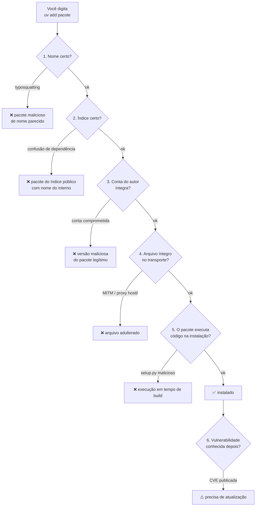

# 21 · Segurança e cadeia de suprimentos

> **Nível:** avançado · **Atualizado em:** 31/08/2026 · **uv 0.12.7**

Instalar um pacote é executar código de estranhos na sua máquina e no seu servidor de
produção. Este arquivo é sobre reduzir isso a um risco administrável.

---

## 1. O modelo de ameaça



Seis ameaças. Vamos a cada uma, com o que o uv faz e o que **você** precisa fazer.

---

## 2. Ameaça 1 — Typosquatting

Alguém publica `reqeusts`, `python-dateutil2`, `beautifulsoup` (o certo é `beautifulsoup4`)
esperando que você erre. É a ameaça mais comum e a mais boba.

**O que o uv faz:** nada. Não há como uma ferramenta saber que você quis dizer outra coisa.

**O que você faz:**

```bash
uv add requests            # deixe o uv resolver o nome exato do PyPI
```
Em vez de copiar e colar de um blog. E, ao adotar um pacote novo:

```bash
uvx --from pip pip index versions NOME   # há quanto tempo existe?
```
Confira em `pypi.org/project/NOME`: número de releases, data do primeiro, link para o
repositório, downloads. Um pacote sério tem histórico. Um pacote publicado ontem, com uma
versão só e sem repositório, merece desconfiança.

**Defesa estrutural:** revisão de código obrigatória em qualquer PR que toque no
`pyproject.toml`. Um humano vendo `+ reqeusts` percebe.

---

## 3. Ameaça 2 — Confusão de dependência

O ataque: sua empresa tem um pacote interno `empresa-auth`, publicado só no índice
privado. Um atacante publica `empresa-auth` **no PyPI público**, com versão 99.0.0. Se a
sua configuração consulta os dois índices e prefere a versão mais alta, você instala o do
atacante — que roda código no seu CI.

Isto não é teórico: foi demonstrado por Alex Birsan em 2021 contra dezenas de empresas
grandes, com bug bounties pagos.

### A defesa no uv

**Errado** — índice extra, sem restrição:
```toml
[[tool.uv.index]]
name = "empresa"
url = "https://artifactory.empresa.com/simple"
# sem `default` nem `explicit`: o uv consulta os DOIS índices para TODO pacote
```

**Certo, opção A** — o índice interno **substitui** o PyPI (ele faz espelho do público):
```toml
[[tool.uv.index]]
name = "empresa"
url = "https://artifactory.empresa.com/api/pypi/pypi-virtual/simple"
default = true
```

**Certo, opção B** — índices explícitos, com origem fixada por pacote:
```toml
[[tool.uv.index]]
name = "empresa"
url = "https://artifactory.empresa.com/simple"
explicit = true          # só serve a pacotes que o apontem por nome

[tool.uv.sources]
empresa-auth = { index = "empresa" }
empresa-log  = { index = "empresa" }
```

> **`explicit = true` é a única flag deste curso que eu diria que é obrigatória.**
> Sem ela, qualquer índice adicional é uma porta aberta. Vale igualmente para índices de
> terceiros legítimos, como os do PyTorch — ver o exemplo 13 em
> [06-exemplos](06-exemplos.md).

---

## 4. Ameaça 3 — Conta do mantenedor comprometida

O pacote é legítimo, o autor é sério, mas a conta dele foi tomada (phishing, token
vazado) e uma versão maliciosa foi publicada. Aconteceu com `ctx`, `python-dateutil`,
`ua-parser-js` (no npm), `xz-utils` (fora do Python, mas o caso mais grave da década).

**A defesa é temporal.** Ataques assim são descobertos em horas ou dias. Se você não
instala nada recém-publicado, você não é atingido.

```toml
[tool.uv]
exclude-newer = "14 days"
exclude-newer-package = { certifi = "0 days", cryptography = "0 days" }
```

Nenhum pacote publicado nos últimos 14 dias entra na resolução — exceto os que você
isentar por serem críticos de segurança.

| Janela | Proteção | Custo |
|---|---|---|
| 0 dias (padrão) | nenhuma | — |
| 7 dias | pega a maioria dos incidentes | atraso pequeno |
| **14 dias** | pega quase todos | atraso aceitável — **minha recomendação** |
| 30 dias | máxima | você fica notavelmente para trás em correções |

**Segunda defesa:** o lockfile. Com o `uv.lock` versionado, **um pacote novo só entra
quando alguém roda `uv lock` e abre um PR**. O ataque fica visível numa revisão de código
em vez de acontecer silenciosamente no próximo `pip install`.

---

## 5. Ameaça 4 — Adulteração no transporte

**O que o uv faz por você:**

- TLS obrigatório para os índices;
- **hash SHA-256 de cada artefato no `uv.lock`**, verificado na instalação;
- recusa a instalar se o hash não bater.

Isso é forte. Um proxy hostil, um espelho comprometido ou um ataque MITM não conseguem
substituir um arquivo cujo hash está no lock.

**O que enfraquece:**

```bash
--allow-insecure-host    # desliga a verificação TLS. Nunca em CI ou produção
uv export --no-hashes    # o requirements.txt gerado perde os hashes
```

Se você exporta para `requirements.txt` e instala com `pip`, **mantenha os hashes**
(sem `--no-hashes`) e use `pip install --require-hashes`.

---

## 6. Ameaça 5 — Código executado na instalação

Um sdist com `setup.py` executa código arbitrário durante o build. Um wheel, **não** —
ele é só um ZIP que é descompactado.

**Consequência prática e acionável:**

```bash
uv sync --no-build          # proíbe construir qualquer sdist
uv sync --no-build-package pacote-suspeito
```

Se tudo que você usa tem wheel (o normal em 2026), `--no-build` no CI é uma defesa real
e barata: nenhum `setup.py` de terceiro roda na sua máquina.

O `resumo` do projeto-modelo deste curso existe em parte por isso: ele lista os pacotes
que **só têm sdist**, para você saber onde está exposto.

---

## 7. Ameaça 6 — Vulnerabilidades conhecidas

```bash
uv audit
```
Saída real desta máquina (31/08/2026):
```
warning: `uv audit` is experimental and may change without warning.
Resolved 6 packages in 0.71ms
Found no known vulnerabilities and no adverse project statuses in 5 packages
```

Consulta a base de advisories do PyPI. Está em preview, mas funciona.

```bash
uv audit --output-format json      # para pipelines
uv tool audit                       # auditar as ferramentas instaladas
```

Alternativas maduras, que valem em ambiente regulado:

```bash
uvx pip-audit                      # da PyPA; a referência
uvx safety check
```

**Coloque no CI:**
```yaml
- run: uv audit --preview-features audit-command
```

---

## 8. SBOM — a lista de materiais

Cada vez mais exigida por contrato (ordem executiva 14028 nos EUA, Cyber Resilience Act
na União Europeia, que entra em aplicação plena em 2027).

```bash
uv export --format cyclonedx1.5 -o sbom.json
```

CycloneDX é um dos dois padrões (o outro é SPDX). Guarde o SBOM como artefato de cada
release: quando a próxima vulnerabilidade grave sair, a pergunta que chega da diretoria é
"nós usamos isso?" — e a resposta precisa vir em minutos, não em dias.

---

## 9. Checklist de segurança de um projeto Python com uv

**Sempre:**
- [ ] `uv.lock` versionado no Git.
- [ ] `uv sync --locked` no CI e no build da imagem.
- [ ] `uv lock --check` como portão de PR.
- [ ] Revisão obrigatória em PRs que alteram `pyproject.toml` ou `uv.lock`.
- [ ] `uv audit` (ou `pip-audit`) no CI.
- [ ] Versão do uv fixada no CI.

**Em produção ou ambiente regulado:**
- [ ] `exclude-newer = "14 days"` com exceções documentadas.
- [ ] Índice interno com `default = true`, ou `explicit = true` em todo índice extra.
- [ ] `--no-build` onde for possível.
- [ ] SBOM gerado e arquivado por release.
- [ ] Trusted Publishing (OIDC) em vez de token, se você publica.
- [ ] Container rodando como usuário sem privilégio, sem o uv na imagem final.
- [ ] Segredos fora do `pyproject.toml` e fora do sdist — conferir o `.tar.gz` antes de publicar.

**Nunca:**
- [ ] ❌ `--allow-insecure-host` em CI ou produção.
- [ ] ❌ índice extra sem `explicit`.
- [ ] ❌ token de PyPI de longa duração em secret quando OIDC está disponível.
- [ ] ❌ `curl | sh` de fonte não oficial (o `astral.sh/uv/install.sh` é o oficial;
      inspecione antes se sua política exigir).

---

## 10. Sobre confiar no próprio uv

Uma pergunta legítima: você está instalando um binário que baixa e executa código.

| Aspecto | Situação em 31/08/2026 |
|---|---|
| Código-fonte | aberto, MIT/Apache-2.0, em [github.com/astral-sh/uv](https://github.com/astral-sh/uv) |
| Builds | GitHub Actions públicas; artefatos com atestado de proveniência |
| Distribuição | GitHub Releases e `astral.sh` (que redireciona para o GitHub) |
| Governança | OpenAI, desde 19/03/2026. Sem fundação, sem comitê independente |
| Auditoria externa | não conheço uma auditoria de segurança pública e independente publicada |
| Superfície | binário grande, em Rust; sem `unsafe` disseminado, mas grande |

**Mitigações práticas, em ordem de esforço:**

1. **Fixe a versão** em todo lugar (CI, Docker, `required-version`). Uma versão fixada e
   testada não muda embaixo de você.
2. **Verifique o checksum** ao baixar em ambiente sensível: os releases do GitHub trazem
   `.sha256` para cada artefato.
3. **Espelhe internamente** o binário aprovado, em vez de baixar do `astral.sh` em cada
   build.
4. **Não dê ao CI mais permissão do que ele precisa.** Um `uv sync` não precisa de acesso
   de escrita a nada além do workspace.

> **Minha posição:** o risco de usar o uv não é maior que o de usar `pip` — e é menor em
> um aspecto importante, porque a verificação de hash do lock é obrigatória por padrão, o
> que no `pip` exige configuração explícita. O risco maior continua sendo, de longe, **os
> pacotes que você instala**, não a ferramenta que os instala.

---

## 11. Os cinco porquês: por que a cadeia de suprimentos Python é frágil?

**1. Por que qualquer pessoa pode publicar no PyPI?**
Porque o PyPI é aberto por princípio: basta uma conta e um e-mail confirmado.

**2. Por que não há curadoria?**
Porque curar 600 mil projetos exigiria uma equipe grande e paga, e a PSF não tem esse
orçamento. **Trade-off econômico explícito, e declarado pela própria PSF** nas discussões
de financiamento do PyPI.

**3. Por que instalar executa código?**
Porque o `setup.py` é executável, por herança do `distutils` de 2000
(ver [11-historia](11-historia.md)). Os wheels resolveram isso — mas só para os pacotes
que publicam wheel.

**4. Por que não exigir assinatura de todos os pacotes?**
Houve tentativas: a PEP 458 (TUF, *The Update Framework*) foi aceita em 2019 e a
implementação avançou devagar por anos, por falta de recursos. Assinatura por GPG foi
**removida** do PyPI em 2023 porque quase ninguém usava e as poucas assinaturas existentes
não eram verificáveis na prática (chaves não publicadas, não revogadas, não confiáveis).
**Parada legítima: é uma decisão documentada, baseada em dados de uso reais.**

**5. Por que o modelo de "hash no lockfile" acabou virando a defesa principal?**
Porque ele é **barato, verificável e local**: não exige infraestrutura de confiança, não
exige que o autor faça nada, e protege contra o ataque mais provável (substituição do
artefato). Não protege contra o autor ser malicioso — para isso não existe defesa técnica,
só reputação, revisão e tempo. É uma defesa incompleta que funciona, contra uma defesa
completa que nunca foi implantada.

---

## Autoteste

1. Liste as seis ameaças do modelo e diga contra quais o uv protege sozinho.
2. O que é confusão de dependência, e qual é a configuração que a previne?
3. Por que `explicit = true` é a flag mais importante deste arquivo?
4. Como `exclude-newer` protege contra uma conta de mantenedor comprometida?
5. Qual janela de cooldown este curso recomenda, e qual o custo dela?
6. Por que instalar de wheel é mais seguro que instalar de sdist?
7. Que comando gera um SBOM e por que você guardaria um por release?
8. Cite três coisas que **nunca** devem aparecer num CI que usa uv.
9. Quais são as quatro mitigações para o risco de confiar no próprio uv?
10. Por que a assinatura GPG foi removida do PyPI, e o que ficou no lugar?

---

**Fontes (consultadas em 31/08/2026):**
[docs.astral.sh/uv/concepts/indexes](https://docs.astral.sh/uv/concepts/indexes/) ·
[docs.astral.sh/uv/concepts/resolution](https://docs.astral.sh/uv/concepts/resolution/) ·
[blog.pypi.org — remoção do suporte a GPG (2023)](https://blog.pypi.org/posts/2023-05-23-removing-pgp/) ·
[PEP 458](https://peps.python.org/pep-0458/) ·
[docs.pypi.org/trusted-publishers](https://docs.pypi.org/trusted-publishers/) ·
Alex Birsan, *"Dependency Confusion"* (2021) ·
saída de `uv audit` executada localmente.

**Próximo:** [60-teoria-avancada.md](60-teoria-avancada.md)
